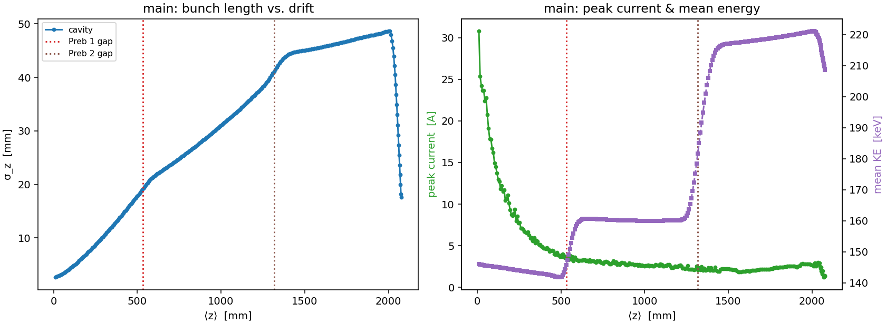
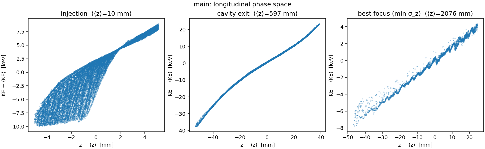
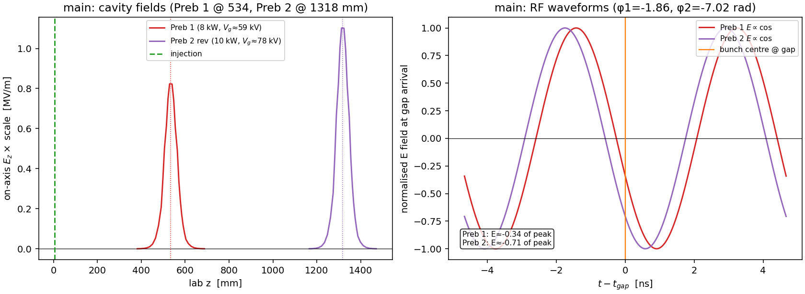
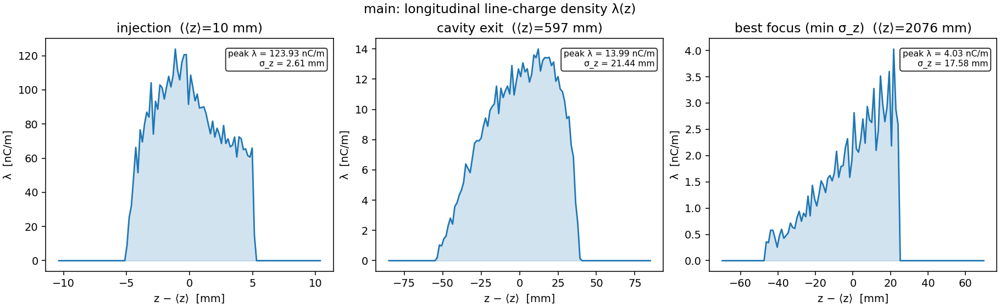

# Figures

A visual index of the result figures produced by each stage's `plot_*.py` script, with the
physics each one demonstrates. Every figure is written to its stage's `results/` directory by
reading that stage's `diags/` openPMD output — `results/` is git-ignored, so regenerate the PNGs
by re-running the plot script (or the full pipeline). The figures that *are* committed are added
explicitly with `git add -f <stage>/results/*.png`.

Regenerate everything:

```bash
conda activate CBB
python -c "import cathode; cathode.plot()"        # → cathode/results/
python -c "import gun; gun.plot()"                # → gun/results/
python -c "import injector; injector.plot()"      # → injector/results/ (diags/main + any P* scan)
python -c "import linac_sec1; linac_sec1.plot()"  # → linac_sec1/results/
python -c "import pipeline; pipeline.plot_chain()"  # → results/ (cross-stage)
```

(Each `plot_*.py` is also runnable directly via `python <stage>/plot_<stage>.py` — the package
facade is just the preferred entry point.) The repo-root `results/` is git-ignored by the existing
`results/` pattern — its cross-stage PNGs are committed with `git add -f results/*.png`.

> **Profile note.** The committed PNGs are regenerated by `pipeline/run_pipeline.py` at its
> **Balanced** performance profile (the active preset in that script), not the slower default-config
> grids. The numbers quoted below match that run. Re-running at the stage defaults sharpens the
> figures slightly but does not move the headline numbers (the dominant effects — beam energies,
> bunching, capture — are set by the field maps and the inter-stage beam, not the solver fidelity).

The chain is order-dependent — each stage accelerates/transports the previous stage's beam:

```
cathode  ─►  gun  ─►  injector  ─►  linac_sec1
(SCL diode)  (~146 keV)  (2 prebunchers + 3 solenoids)  (~16 MeV captured)
```

---

## 0. Cross-stage — `results/`

`pipeline/plot_chain.py` (`pipeline.plot_chain()`) reads every stage's openPMD series, builds one
per-dump moment table per stage, and renders four figures into the **repo-root `results/`** —
the whole-chain view. Called automatically at the end of `pipeline/run_pipeline.py`.

### `chain_evolution.png` — beam moments vs lab ⟨z⟩
3×2 panels across cathode→gun→injector→linac vs lab ⟨z⟩: ⟨KE⟩ (±σ band, log-y), ε_n,x, σ_x/σ_r,
σ_z (log-y), within-stage charge fraction, and I_peak. **Caveats baked into the figure:** the
**cathode→gun ε_n,x step is a 2D→RZ definitional discontinuity** (the cathode is 2D x–z, slab
x-emittance; downstream is RZ-projected) — annotated, not physical growth. The σ_r / capture
caveat that the lab-frame ES self-field overestimates transverse SC by ~γ²≈1.7× (a conservative
lower bound) is noted on the σ_x panel.

### `emittance_budget.png` — ε_n,x entry vs exit per stage
A waterfall of transverse normalized emittance at each stage's entry vs exit — which stage degrades
beam quality. The cathode→gun bar carries the 2D→RZ definitional footnote.

### `transmission_waterfall.png` — the two-loss charge chain
gun exit → injector exit (in-domain) → **enters bore** (9.547 mm iris) → **captured** (~16 MeV).
The bore-scrape and the RF-capture losses are **separate bars** — the separation that motivates the
upstream solenoids. Starts at gun exit (physical ~1 nC renorm); the cathode's raw macroparticle
weight is excluded (not a physical charge). Capture is vs the **true injected charge**.

### `chain_scorecard.png` — per-stage entry/exit table
Per-stage entry/exit ⟨KE⟩, σ_KE, ε_n,x, σ_x, σ_z, charge, and the end-to-end capture (vs true
injected). σ_KE is **charge-conditional** (a single-snapshot value), and the capture is the
γ²-conservative lower bound. Also printed to stdout/log. (Longitudinal ε_n,z, where reported, is
the z–(γβ_z) emittance in mm — NOT mm·mrad.)

---

## 1. Cathode — `cathode/results/`

Finite-extent, space-charge-limited (Child–Langmuir) diode in **2D x–z**: cathode plane at
`z = 0` (0 V), anode at `z = d = 0.2 mm` (+60 V), electrons emitted only from the finite patch
`|x| < 8 mm`. The run deliberately **over-injects at 2× J_CL** and lets the self-consistent
fields do the limiting — the answer is not imposed. Produced by `plot_cathode.py`.

### `child_langmuir.png` — the validation


On-axis (center of the cathode) potential `φ(z)` and longitudinal field `E_z(z)` from WarpX,
overlaid with the 1D planar Child–Langmuir laws `φ = V(z/d)^{4/3}`,
`E_z = −(4V/3d)(z/d)^{1/3}` and the vacuum (no-space-charge) linear reference. The WarpX curve
sits right on the 4/3-power potential, and the field is **driven to ≈0 at the cathode** instead
of uniform — the defining signature of space-charge-limited emission (the virtual cathode
reflecting excess current).

### `cathode_2d.png` — the 2D structure


Three side-by-side 2D maps across the gap: charge density `|ρ|` (√/PowerNorm scale), potential
`φ`, and field magnitude `|E|`. The white bar marks the emitting cathode patch (z = 0,
`|x| < 8 mm`). You can see (1) the dense space-charge / virtual-cathode layer hugging the
emitting strip, (2) the potential depression in the beam column, and (3) the **field transition
at the cathode edges** `x = ±8 mm`, where the field-suppressed emitting strip meets the full
vacuum field outside — the finite-cathode signature absent from planar theory.

### `current_saturation.png` — self-limiting emission


Transmitted current density at the anode vs. time (integrated across the beam, referenced to the
cathode width `2R`). Despite injecting **2× J_CL** (red dotted reference, above this zoomed view),
the transmitted current ramps up during gap-fill and then settles near `J_CL` (dashed,
≈ 2.71 × 10⁴ A/m²; slightly above it, ≈ 108% in this run — the wide cathode / narrow gap is deep
in the 1D limit and the finite cathode temperature pushes emission just past the cold-emission
value). The cathode does **not** pass the 2× current it is fed; space charge regulates it.
Linear y-axis anchored at the
origin so both the turn-on ramp and the plateau-vs-`J_CL` are visible to scale.

### `rho_z_time.png` — space-charge cloud build-up


On-axis charge density `|ρ|(z, t)` (√ scale) over the turn-on transient — the space-charge cloud
building up and filling the gap (gap-fill ≈ 480 steps). Time sampling is non-uniform (dense
through the transient, sparse in steady state), so it is drawn with `pcolormesh` on the true time
coordinates rather than `imshow`, which would distort the time axis.

### `field_lines.png` — the 2D cathode-edge field transition


φ equipotential contours overlaid on E-field streamlines (coloured by `|E|`) across the gap, with a
zoom on the `+x` cathode edge. Planar Child–Langmuir theory is 1D — flat equipotentials, straight
field — but the cathode is **finite**: the space-charge-suppressed emitting strip (`|x| < 8 mm`,
white bar) meets the full vacuum field outside. At the edges `x = ±8 mm` (dotted lines) the
equipotentials **crowd together and the streamlines splay** as `|E|` climbs from its suppressed value
on the emitting surface up to the uniform vacuum field outside — the **field transition** at the
emission edge (a transition, not an overshoot: `|E|` rises monotonically to `V/d` and does not exceed
it), the finite-cathode signature the planar picture cannot show. The contour companion to the `φ`
panel of `cathode_2d.png`.

### `emission_phase_space.png` — the source's thermal emittance


The intrinsic (thermal) beam quality of the source, from the last particle snapshot. **Left:**
transverse phase space `x` vs. `ux = γβ_x` (density via hexbin), annotated with the RMS normalized
emittance `εn,x = √(⟨x²⟩⟨ux²⟩ − ⟨x·ux⟩²) ≈ 2.29 mm·mrad` — the irreducible emittance every downstream
stage inherits. **Right:** the histogram of `ux`, the Maxwellian transverse-momentum spread set by
the 1425 K cathode, with the expected `±√(kT/mₑc²)` scale overlaid (the run reproduces it: rms
`ux` = 0.49 × 10⁻³ vs. √(kT/mc²) = 0.49 × 10⁻³).

---

## 2. Gun — `gun/results/`

CESR electrostatic gun ("Chili Gun Mk II", ~150 kV) in **RZ**, using the Poisson–Superfish field
map `CESR_gun.gdf` scaled to a −150 kV cathode. The gun field is applied as an external electrode
field; WarpX supplies the self-consistent space charge on top. The injected beam is the cathode
exit phase space, slab→radius remapped and renormalized to a 1 nC bunch. Produced by
`plot_gun.py`.

### `gun_field.png` — the accelerating field


Left: on-axis applied field `E_z(z)` (MV/m) of the scaled `CESR_gun.gdf` map — negative
(accelerating in +z), `≈ −1.94 MV/m` at the cathode and peaking `≈ −4.88 MV/m` near z ≈ 28 mm.
Right: the implied on-axis potential `V(z) = −∫E_z dz` (cathode → exit), a total ~150 kV drop.
This is the field the beam sees.

### `beam_rz.png` — transport through the gun


`r–z` 2D histograms (log color) of the beam at three snapshots — launch, mid-gun, exit — showing
transport through the gun, including the near-cathode radial focusing as the beam accelerates.

### `energy_gain.png` — energy gain along the gun


Mean and max kinetic energy of the beam vs. mean position `⟨z⟩`, climbing toward the 150 keV
gun-voltage line (dotted). The gain tracks `∫ e·|E_z| dz` (≈ 7.5 keV by z ≈ 4 mm), approaching the
~150 keV cathode→exit potential drop (mean exit KE ≈ 146 keV; ~83 % of the 1 nC bunch reaches the exit).

### `exit_phase_space.png` — exit beam


Left: longitudinal phase space (`z` vs. `KE`) at the last dump. Right: the final energy spectrum
(histogram) with `⟨KE⟩` marked — a narrow distribution at ~146 keV, the beam handed off to the
injector.

### `beam_envelope.png` — radial envelope and emittance


The near-cathode focusing that `beam_rz.png` shows only as three snapshots, quantified along the
gun. **Blue:** the RMS radial size `σ_r = √⟨x²⟩` (the per-plane RMS the plot axis is labelled with)
contracts from ≈ 4.0 mm at launch to a ≈ 2.8 mm waist near the exit as the diverging cathode
emission is focused by the radial gun field (the full-radial `√⟨r²⟩ = √2·σ_x` is ≈ 5.7 → 4.1 mm).
**Red (twin axis):**
the normalized transverse emittance `εn,x = √(⟨x²⟩⟨ux²⟩ − ⟨x·ux⟩²)` grows as space charge and
field nonlinearities act — the beam-quality cost of the transport.

### `space_charge.png` — the beam's own space-charge field


The beam **self-field** dumped to `diags/fields` (`ρ`, `φ`) — distinct from the *applied* gun field
in `gun_field.png`, and plotted nowhere else. At a near-launch snapshot (`⟨z⟩ ≈ 0.4 mm`, beam still
near the cathode where the self-field is largest): **top**, the self charge density `ρ(r, z)` of the
electron bunch (`ρ < 0`); **bottom**, the **space-charge potential well** `φ(r, z)` it digs (≈ −250 V
near launch for the 1 nC bunch). This is the field the README renormalizes the bunch to 1 nC to control —
the raw ~82 nC cathode population would dig a well that dwarfs the gun field and blows the beam apart.

---

## 3. Injector — `injector/results/`

The full LinacSim injector subsection in **one RZ** space-charge run (replacing the old
single-cavity prebuncher stage): Lens 0A → Prebuncher 1 (8 kW @ 0.534 m) → Prebuncher 2
(10 kW, reversed, @ 1.318 m) → Sol 0 / Lens 0E, then the 9.547 mm collimator. Two-cavity velocity
bunching + solenoid focusing over ~2 m; hands a focused, collimated beam to the linac at z ≈ 2.03 m.
Produced by `plot_injector.py`, which reads `injector/diags/main` (and any `diags/P*` scan dirs)
and writes the figures below with **config-independent filenames**.

### `injector_line.png` — bunch length, current, energy


**Left:** bunch length `σ_z(z)` along the line, with vertical markers at both prebuncher gaps
(Z1 = 534 mm, Z2 = 1318 mm). The two-cavity distributed buncher drives σ_z well below the drift
baseline (σ_drift/σ_2cav ≈ 4.4× near the focus, ≈ 2.4× vs Preb-1 alone). **Right:** peak current
and mean KE — the two mild kicks (Preb-1 +20 keV, Preb-2 +43 keV mean) raise ⟨KE⟩ through the line.

### `injector_phasespace.png` — the chirp through the two cavities


Mean-subtracted `z–KE` phase space at injection / cavity exit / best focus. The two cavities drive
the head→tail chirp compressive (net chirp past Z2 turns negative), unlike the single-cavity
prebuncher which barely perturbed the gun beam.

### `injector_cavity.png` — the RF drive (both cavities)


**Left:** on-axis `Ez(z)` of both scaled 1-J cavity maps placed at their lab gaps — Preb 1 @ 534 mm
(8 kW, V_gap ≈ 59 kV) and Preb 2 @ 1318 mm (10 kW reversed, V_gap ≈ 78 kV). **Right:** the temporal
RF waveform `E ∝ cos(ωt+φ)` at each cavity's bunch arrival, with the bunch-centre marker; the
scale/phase are re-derived exactly as the sim drives them (crest base + GUI φ_off; Preb-2's reversed
install is `PREB2_REV_PHASE=0` — the +π is absorbed by crest-referencing the loaded field).

### `injector_bunch_profile.png` — the real longitudinal bunch shape λ(z)


The line-charge density `λ(z−⟨z⟩)` at the same three snapshots — the actual bunch shape (peak λ,
σ_z) the scalar σ_z curve cannot show.

### `compare_power_phase.png` — scan summary *(when present)*
Written only when a scan has been run (a Python loop over `injector.run(plots=False)` with a
per-case `OUTDIR`, plus an optional `P0_drift` baseline). σ_z(z) for the baseline vs each powered
case, and the max bunching ratio vs power. The faithful default is the two-cavity 8/10 kW point;
the scan is exploration only. (Note: a hard Preb-1 power scan desyncs the Preb-2 phase reference —
see `injector/README.md`.)

---

## 4. Linac Section 1 — `linac_sec1/results/`

SLAC-design 3 m, 86-cell, **2π/3 traveling-wave** accelerating structure in **RZ** (f = 2856 MHz),
synthesised from the two quadrature field maps and driven at the original LinacSim **P = 11 MW**.
**No in-stage solenoid** — focusing is upstream in the injector. The linac reads the injector's
focused beam at the **z ≈ 2.03 m handoff** and applies the **9.547 mm iris cut** at injection.
At the faithful currents the injector beam has re-expanded to σ_r ≈ 16 mm by the handoff (its waist
is upstream at ~1.45 m), so only ~8–20 % passes the iris and the linac captures **order ~1 % of the
true injected charge** to ⟨KE⟩ ≈ 16 MeV (max ~30 MeV). Produced by `plot_linac_sec1.py` from the
run (`diags/main`) at `PHASE_DEG = 0`. Capture is a **conservative γ²≈1.7× lower bound**, ~7×
sensitive to the upstream LENS_0A placement, and reported against the **true injected charge**
(sidecar `injection_summary.json`), not the post-collimation first dump.

### `linac_field.png` — the traveling wave


The accelerating field the beam rides. **Top:** the on-axis traveling-wave amplitude
`|Ez|(z) = scale·|EzRe + iEzIm|` (≈ 15 MV/m peak at 11 MW; its z-integral is the ≈ 35 MV on-crest
voltage). **Bottom:** a fixed-time snapshot `Ez(z, t₀)` zoomed to the structure entrance, showing
the ~3.5 cm 2π/3 cell structure (the field reverses cell-to-cell; the forward traveling wave is the
sum of the two 90°-offset quadrature maps).

### `energy_gain.png` — ~146 keV → ~16 MeV (captured slice)


Mean and max kinetic energy vs ⟨z⟩ climb across the shaded structure from ~146 keV; the small
captured slice reaches max ~30 MeV with charge-weighted ⟨KE⟩ ≈ 16 MeV (σ_KE ≈ 7 MeV), then goes
flat in the field-free exit drift (the beam coasts). The β = v/c trace (right axis) shows the
**capture**: the captured particles become relativistic (β → 1), while the bulk that is not
captured (out of the RF bucket) falls behind.

### `long_phase_space.png` — capture into the RF bucket


Mean-subtracted longitudinal `z–KE` phase space at injection, mid-structure, and exit. The
injection beam (left) is collimated to the 9.547 mm iris; the thin surviving slice (right) spreads
over a broad energy range as only a fraction locks to the crest — the signature of capturing a
sub-relativistic beam into a phase-velocity-c wave.

### `beam_envelope.png` — focusing and adiabatic damping


**Top:** RMS transverse size σ_x vs ⟨z⟩ with the structure bore (9.55 mm) marked; **bottom:**
surviving charge fraction q/q_inj normalised to the **injected** charge. The curve drops at the
first dump (the r > 9.547 mm iris collimation) then decays through the RF-capture loss. The
surviving slice adiabatically damps (σ_r ∝ 1/√(γβ)) as it accelerates.

### `exit_spectrum_capture.png` — the output beam


Charge-weighted exit energy spectrum (pC per bin) with the mean ± RMS marked, titled with the
captured fraction **of the true injected charge** (order ~1 % at the faithful 11 MW point) and
annotated with how much passed the 9.547 mm iris. The surviving particles span a broad ~5–30 MeV
distribution with charge-weighted ⟨KE⟩ ≈ 16 MeV (σ_KE ≈ 7 MeV) — wide because only a thin,
phase-spread slice locks to the crest. The capture is a conservative γ² lower bound and
tune-sensitive to the upstream lens placement; the injector current/phase scans characterize the
achievable value.
