# Figures

A visual index of the result figures produced by each stage's `plot_*.py` script, with the
physics each one demonstrates. Every figure is written to its stage's `results/` directory by
reading that stage's `diags/` openPMD output — `results/` is git-ignored, so regenerate the PNGs
by re-running the plot script (or the full pipeline). The figures that *are* committed are added
explicitly with `git add -f <stage>/results/*.png`.

Regenerate everything:

```bash
conda activate CBB
python -c "import cathode; cathode.plot()"        # → cathode/results/
python -c "import gun; gun.plot()"                # → gun/results/
python -c "import prebuncher; prebuncher.plot()"  # → prebuncher/results/ (all P* cases)
python -c "import linac_sec1; linac_sec1.plot()"  # → linac_sec1/results/ (main + scan + focusoff)
```

(Each `plot_*.py` is also runnable directly via `python <stage>/plot_<stage>.py` — the package
facade is just the preferred entry point.)

The chain is order-dependent — each stage accelerates/transports the previous stage's beam:

```
cathode  ─►  gun  ─►  prebuncher  ─►  linac_sec1
(SCL diode)  (~148 keV)  (RF bunching)  (~37 MeV)
```

---

## 1. Cathode — `cathode/results/`

Finite-extent, space-charge-limited (Child–Langmuir) diode in **2D x–z**: cathode plane at
`z = 0` (0 V), anode at `z = d = 0.1 mm` (+50 V), electrons emitted only from the finite patch
`|x| < 6 mm`. The run deliberately **over-injects at 2× J_CL** and lets the self-consistent
fields do the limiting — the answer is not imposed. Produced by `plot_cathode.py`.

### `child_langmuir.png` — the validation
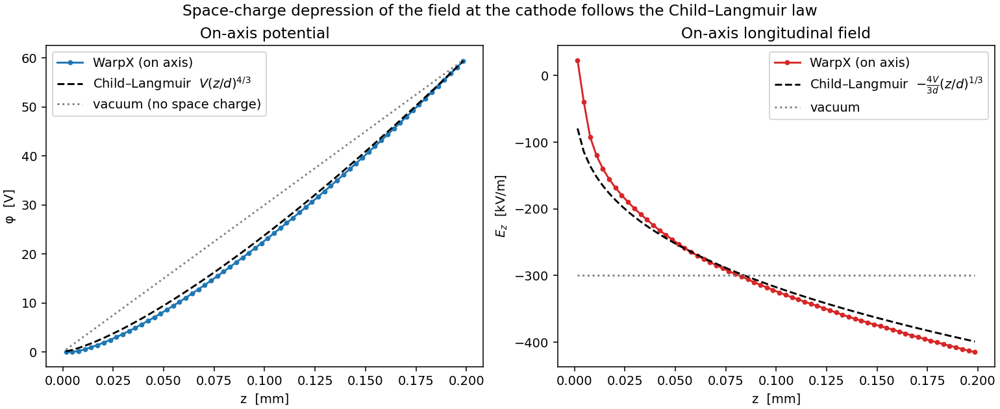

On-axis (center of the cathode) potential `φ(z)` and longitudinal field `E_z(z)` from WarpX,
overlaid with the 1D planar Child–Langmuir laws `φ = V(z/d)^{4/3}`,
`E_z = −(4V/3d)(z/d)^{1/3}` and the vacuum (no-space-charge) linear reference. The WarpX curve
sits right on the 4/3-power potential, and the field is **driven to ≈0 at the cathode** instead
of uniform — the defining signature of space-charge-limited emission (the virtual cathode
reflecting excess current).

### `cathode_2d.png` — the 2D structure


Three side-by-side 2D maps across the gap: charge density `|ρ|` (√/PowerNorm scale), potential
`φ`, and field magnitude `|E|`. The white bar marks the emitting cathode patch (z = 0,
`|x| < 6 mm`). You can see (1) the dense space-charge / virtual-cathode layer hugging the
emitting strip, (2) the potential depression in the beam column, and (3) the **field transition
at the cathode edges** `x = ±6 mm`, where the field-suppressed emitting strip meets the full
vacuum field outside — the finite-cathode signature absent from planar theory.

### `current_saturation.png` — self-limiting emission
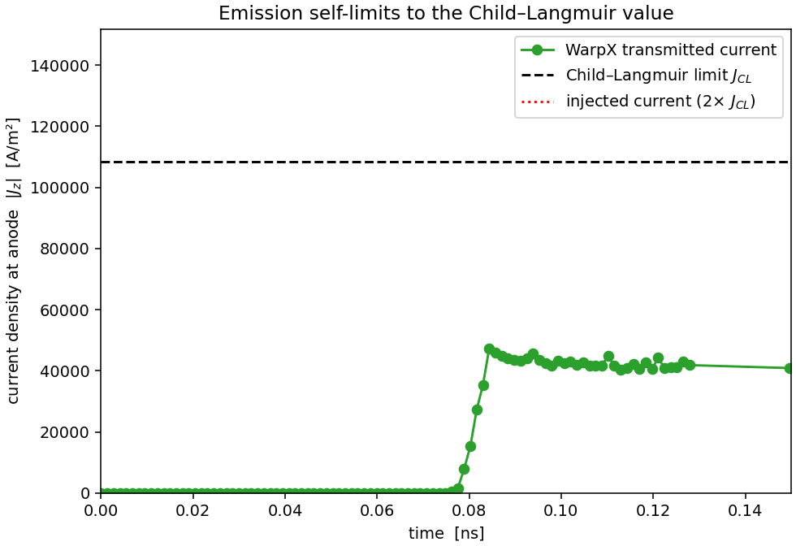

Transmitted current density at the anode vs. time (integrated across the beam, referenced to the
cathode width `2R`). Despite injecting **2× J_CL** (red dotted reference, above this zoomed view),
the transmitted current ramps up during gap-fill and then settles near `J_CL` (dashed,
≈ 8.25 × 10⁴ A/m²; slightly above it, ≈ 110% in this run — the wide cathode / narrow gap is deep
in the 1D limit and the finite cathode temperature pushes emission just past the cold-emission
value). The cathode does **not** pass the 2× current it is fed; space charge regulates it.
Linear y-axis anchored at the
origin so both the turn-on ramp and the plateau-vs-`J_CL` are visible to scale.

### `rho_z_time.png` — space-charge cloud build-up
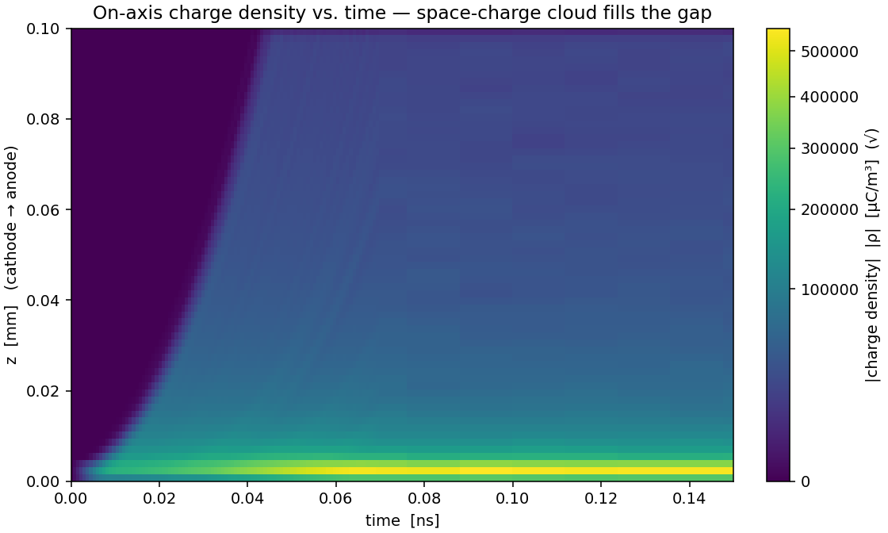

On-axis charge density `|ρ|(z, t)` (√ scale) over the turn-on transient — the space-charge cloud
building up and filling the gap (gap-fill ≈ 480 steps). Time sampling is non-uniform (dense
through the transient, sparse in steady state), so it is drawn with `pcolormesh` on the true time
coordinates rather than `imshow`, which would distort the time axis.

### `field_lines.png` — the 2D cathode-edge field enhancement
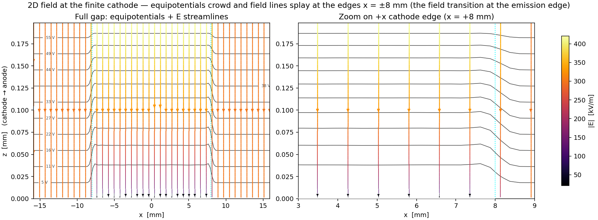

φ equipotential contours overlaid on E-field streamlines (coloured by `|E|`) across the gap, with a
zoom on the `+x` cathode edge. Planar Child–Langmuir theory is 1D — flat equipotentials, straight
field — but the cathode is **finite**: the space-charge-suppressed emitting strip (`|x| < 6 mm`,
white bar) meets the full vacuum field outside. At the edges `x = ±6 mm` (dotted lines) the
equipotentials **crowd together and the streamlines splay** as `|E|` climbs from its suppressed value
on the emitting surface up to the uniform vacuum field outside — the **field transition** at the
emission edge (a transition, not an overshoot: `|E|` rises monotonically to `V/d` and does not exceed
it), the finite-cathode signature the planar picture cannot show. The contour companion to the `φ`
panel of `cathode_2d.png`.

### `emission_phase_space.png` — the source's thermal emittance
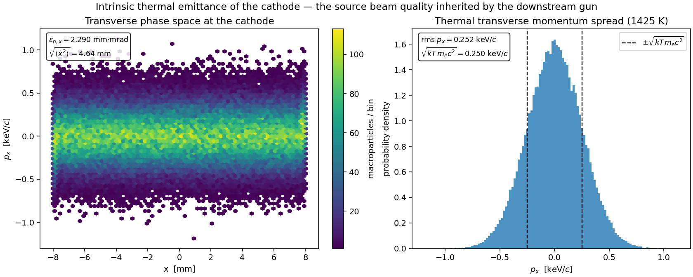

The intrinsic (thermal) beam quality of the source, from the last particle snapshot. **Left:**
transverse phase space `x` vs. `ux = γβ_x` (density via hexbin), annotated with the RMS normalized
emittance `εn,x = √(⟨x²⟩⟨ux²⟩ − ⟨x·ux⟩²) ≈ 1.57 mm·mrad` — the irreducible emittance every downstream
stage inherits. **Right:** the histogram of `ux`, the Maxwellian transverse-momentum spread set by
the 1200 K cathode, with the expected `±√(kT/mₑc²)` scale overlaid (the run reproduces it: rms
`ux` = 0.45 × 10⁻³ vs. √(kT/mc²) = 0.45 × 10⁻³).

---

## 2. Gun — `gun/results/`

CESR electrostatic gun ("Chili Gun Mk II", ~150 kV) in **RZ**, using the Poisson–Superfish field
map `CESR_gun.gdf` scaled to a −150 kV cathode. The gun field is applied as an external electrode
field; WarpX supplies the self-consistent space charge on top. The injected beam is the cathode
exit phase space, slab→radius remapped and renormalized to a 0.1 nC bunch. Produced by
`plot_gun.py`.

### `gun_field.png` — the accelerating field
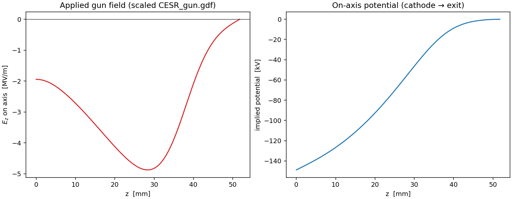

Left: on-axis applied field `E_z(z)` (MV/m) of the scaled `CESR_gun.gdf` map — negative
(accelerating in +z), `≈ −1.94 MV/m` at the cathode and peaking `≈ −4.88 MV/m` near z ≈ 28 mm.
Right: the implied on-axis potential `V(z) = −∫E_z dz` (cathode → exit), a total ~150 kV drop.
This is the field the beam sees.

### `beam_rz.png` — transport through the gun
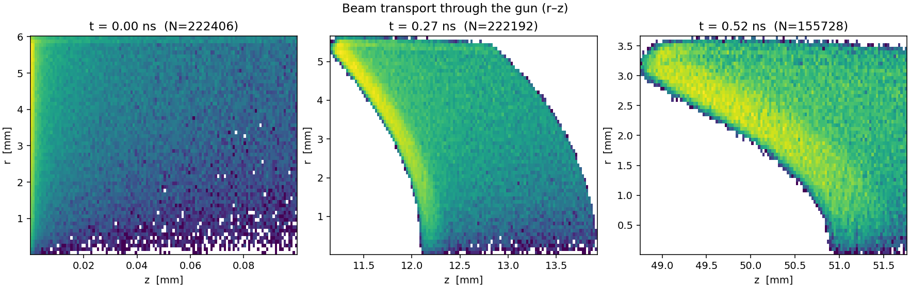

`r–z` 2D histograms (log color) of the beam at three snapshots — launch, mid-gun, exit — showing
transport through the gun, including the near-cathode radial focusing as the beam accelerates.

### `energy_gain.png` — energy gain along the gun
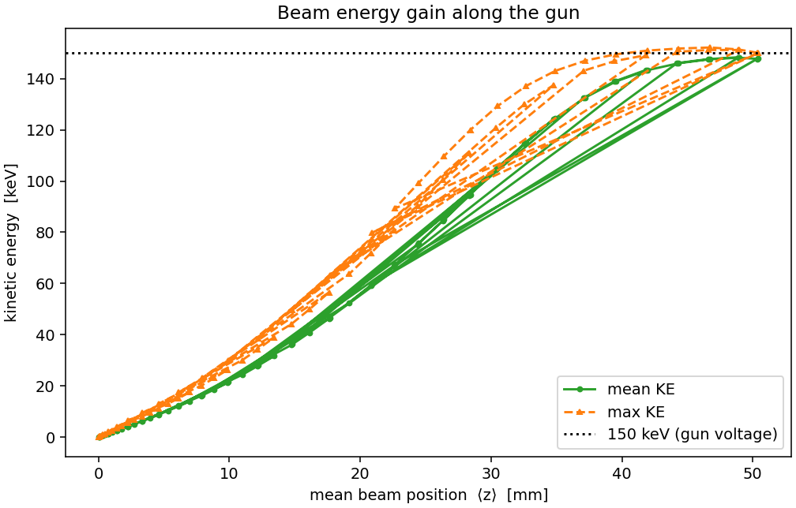

Mean and max kinetic energy of the beam vs. mean position `⟨z⟩`, climbing toward the 150 keV
gun-voltage line (dotted). The gain tracks `∫ e·|E_z| dz` (≈ 7.5 keV by z ≈ 4 mm), approaching the
~150 keV cathode→exit potential drop (mean exit KE ≈ 148 keV).

### `exit_phase_space.png` — exit beam
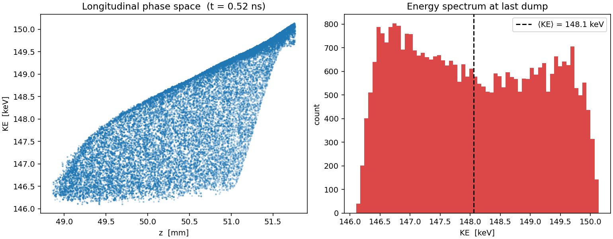

Left: longitudinal phase space (`z` vs. `KE`) at the last dump. Right: the final energy spectrum
(histogram) with `⟨KE⟩` marked — a narrow distribution at ~148 keV, the beam handed off to the
prebuncher.

### `beam_envelope.png` — radial envelope and emittance
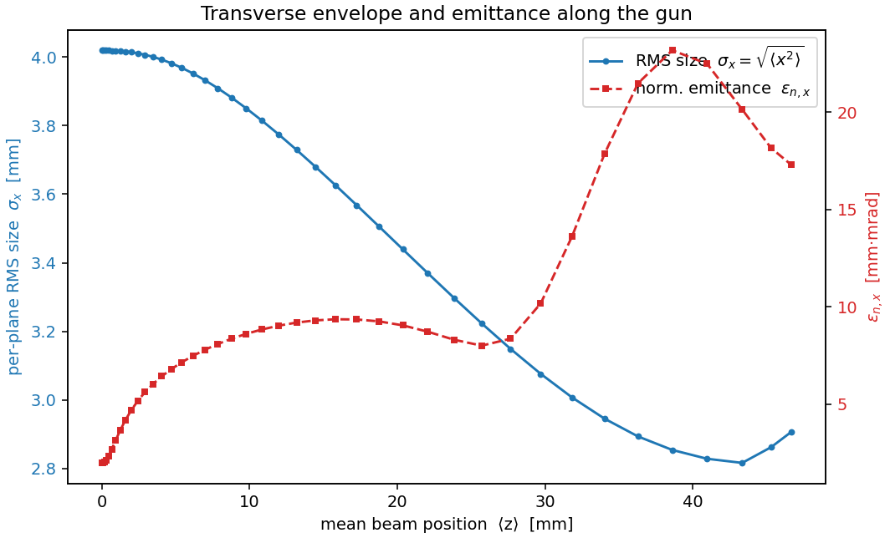

The near-cathode focusing that `beam_rz.png` shows only as three snapshots, quantified along the
gun. **Blue:** the RMS radial size `σ_r = √⟨x²⟩` contracts from ≈ 2.47 mm as the diverging cathode
emission is focused by the radial gun field, reaching a waist near the exit. **Red (twin axis):**
the normalized transverse emittance `εn,x = √(⟨x²⟩⟨ux²⟩ − ⟨x·ux⟩²)` grows as space charge and
field nonlinearities act — the beam-quality cost of the transport.

### `space_charge.png` — the beam's own space-charge field
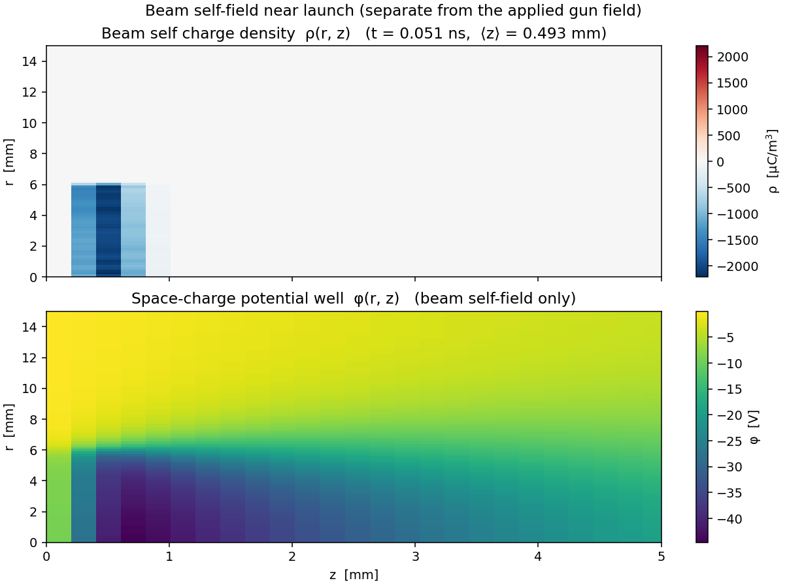

The beam **self-field** dumped to `diags/fields` (`ρ`, `φ`) — distinct from the *applied* gun field
in `gun_field.png`, and plotted nowhere else. At a near-launch snapshot (`⟨z⟩ ≈ 0.4 mm`, beam still
near the cathode where the self-field is largest): **top**, the self charge density `ρ(r, z)` of the
electron bunch (`ρ < 0`); **bottom**, the **space-charge potential well** `φ(r, z)` it digs (≈ −250 V
for the 0.1 nC bunch). This is the field the README renormalizes the bunch to 0.1 nC to control —
the raw ~102 nC cathode population would dig a well that dwarfs the gun field and blows the beam apart.

---

## 3. Prebuncher — `prebuncher/results/`

CESR standing-wave RF prebuncher (214 MHz TM cavity) in **RZ** that velocity-bunches the gun's
exit beam (~148 keV, β ≈ 0.63, 0.1 nC) in the downstream 1.3 m drift. Because the bunch is
already short and space-charge dense, the honest metric is bunching **relative to a drift-only
baseline** (`P = 0`): `σ_z,drift(z) / σ_z,cavity(z)`. Produced by `plot_prebuncher.py`, which
writes `prebuncher_line.png`, `prebuncher_phasespace.png`, `prebuncher_cavity.png`, and
`prebuncher_bunch_profile.png` — **config-independent filenames** (the power/phase lives in the
figure titles and the `diags/<case>` input dir, not the filename), so changing the operating point
overwrites these in place rather than leaving orphans. With several `diags/P*` cases present they
are overwritten (last case wins); the cross-case `compare_power_phase.png` then summarises the scan.

Case names are `P<power>_<phase>`: `<phase>` is `zc` (zero-crossing → ballistic bunching) or
`crest` (max energy gain, little bunching); `P0_drift` is the drift-only baseline.

### `prebuncher_line.png` — bunch length, current, energy
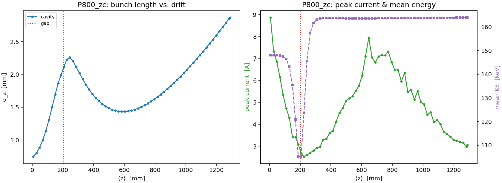

For the plotted case (here 800 W zero-crossing — see the figure title). **Left:** bunch length
`σ_z(z)` for the cavity run, rising to ≈ 2 mm at the gap then dipping to a ballistic focus
(≈ 1.07 mm at ⟨z⟩ ≈ 426 mm) before re-expanding; a `P0_drift` baseline, when present, is overlaid
(`k--`) with the max-bunching point (`σ_drift/σ_cavity`) starred. **Right:** peak current
`I_peak(z)` and mean `KE(z)` on twin axes — the mean energy dips while the bunch transits the
(long) cavity field and recovers to ~148 keV, the net-zero energy gain expected at the zero-crossing.

### `prebuncher_phasespace.png` — the chirp flipping through the cavity
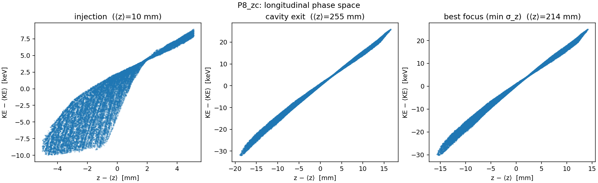

Mean-subtracted longitudinal `z–KE` phase space at three points: injection, cavity exit, and the
best ballistic focus (the `σ_drift/σ_cavity` maximum when a drift baseline is present, otherwise the
post-cavity `σ_z` minimum — ⟨z⟩ ≈ 426 mm here). The gun beam arrives with an intrinsic **+1.40 keV/mm** (debunching) chirp; the
zero-crossing cavity adds a negative chirp, flipping the net slope and rotating the distribution
so it compresses downstream. (On-crest cases, by contrast, mostly shift up in energy without a
chirp flip — visible by comparing a `crest` phasespace figure.)

### `prebuncher_cavity.png` — the RF drive the bunch sees
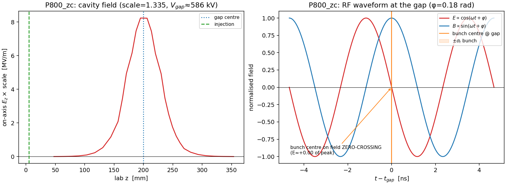

The cavity field itself (the σ_z / phase-space figures show only the beam's response). **Left:**
on-axis `Ez(z)` of the 1-J map scaled by this case's field `scale` (≈ 8.2 MV/m peak at 800 W),
placed at the lab gap (`Z_GAP_CENTER` = 0.20 m) via the map's `grid_global_offset`, with the
injection plane marked. **Right:** the temporal RF waveform `E ∝ cos(ω t+φ)`, `B ∝ sin(ω t+φ)`
(90° out of phase) over ~2 RF periods around the bunch-centre gap-arrival `t_gap`, each normalised
to ±1, with the bunch `±σ_t` width shaded. For `zc` the bunch centre lands on the field
**zero-crossing** (annotated) → velocity bunching; for `crest` it lands on the **crest** → pure
acceleration. This is what makes "zero-crossing vs. crest" visual.

### `prebuncher_bunch_profile.png` — the real longitudinal bunch shape λ(z)
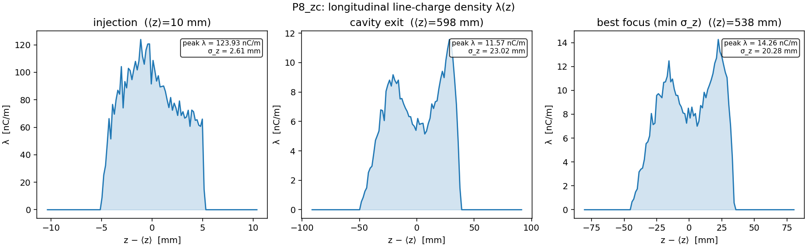

The line-charge density `λ(z−⟨z⟩)` (histogram of `z` weighted by `w·q_e` ÷ bin width, in nC/m) at
the **same** three snapshots as the phase-space figure. Unlike the scalar `σ_z` curve this shows
the bunch's actual shape: a clean peak at injection (σ_z ≈ 1.04 mm, peak `λ` ≈ 43 nC/m), pronounced
**space-charge filamentation spikes** at the cavity exit (σ_z ≈ 1.85 mm, peak `λ` ≈ 14 nC/m), and the
**recompressed** profile at the ballistic focus (σ_z ≈ 1.07 mm, peak `λ` ≈ 24 nC/m). Peak `λ` and
`σ_z` are annotated per panel; a drift baseline is overlaid when present (guarded — none on disk in
the current single-case tree).

### `compare_power_phase.png` — scan summary *(when present)*
A cross-case figure written only when several cases / the drift baseline have been run (e.g. via a
Python loop over `prebuncher.run(plots=False)` with a different `OUTDIR` per call). **Left:**
`σ_z(z)` for the drift baseline vs. each zero-crossing power. **Right:** max bunching
`σ_drift/σ_cavity` vs. RF power, for the zero-crossing and on-crest phases. (Not committed in the
current tree — regenerate by running multiple powers; see `prebuncher/README.md`.)

`plot_prebuncher.py` also prints a summary table to stdout for every case (σ_z0, σ_z,min,
bunching factor, focus z, I_peak, final KE).

---

## 4. Linac Section 1 — `linac_sec1/results/`

SLAC-design 3 m, 86-cell, **2π/3 traveling-wave** accelerating structure in **RZ** (f = 2856 MHz),
synthesised from the two quadrature field maps and driven at P = 15 MW, with a solenoid focusing
channel. The prebuncher's bunched ~148 keV beam is **captured** and accelerated to **~37 MeV**.
Produced by `plot_linac_sec1.py` from the headline run (`diags/main`), the focus-off comparison
(`diags/focusoff`), and the RF-phase scan (`diags/scan_phi*`). The headline operating point (crest
phase, I_sol ≈ 1000 A) is chosen by `linac_sec1.demo()`.

### `linac_field.png` — the traveling wave
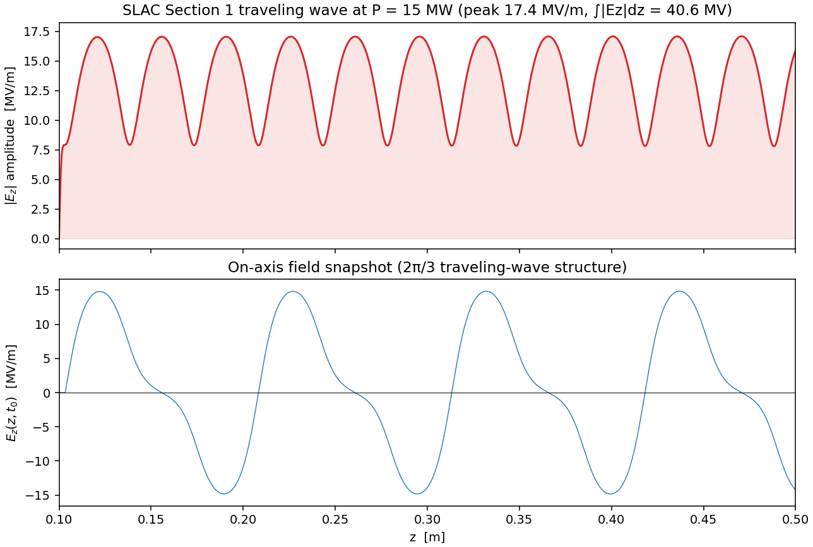

The accelerating field the beam rides. **Top:** the on-axis traveling-wave amplitude
`|Ez|(z) = scale·|EzRe + iEzIm|` (≈ 17 MV/m peak at 15 MW; its z-integral is the ≈ 40 MV on-crest
voltage). **Bottom:** a fixed-time snapshot `Ez(z, t₀)` zoomed to the structure entrance, showing
the ~3.5 cm 2π/3 cell structure (the field reverses cell-to-cell; the forward traveling wave is the
sum of the two 90°-offset quadrature maps).

### `energy_gain.png` — 148 keV → ~37 MeV
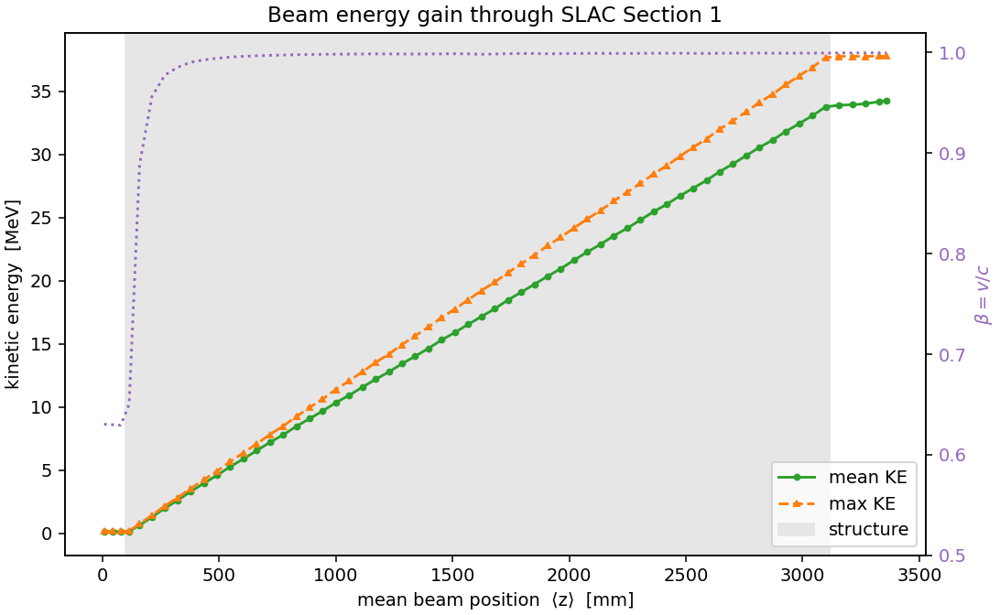

Mean and max kinetic energy vs ⟨z⟩ climb **linearly** across the shaded structure (≈ 12 MV/m
effective gradient) from 148 keV to ~37 MeV (⟨KE⟩ ≈ 34 MeV, max ≈ 38 MeV), then go flat in the
field-free exit drift (the beam coasts). The β = v/c trace (right axis) shows the **capture**: the
injected β ≈ 0.63 beam becomes relativistic (β → 1) within the first ~0.2 m, after which it is
locked to the wave.

### `long_phase_space.png` — capture into the RF bucket
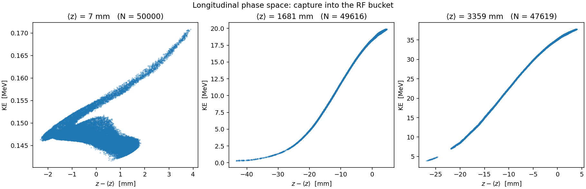

Mean-subtracted longitudinal `z–KE` phase space at injection, mid-structure, and exit. The
velocity-modulated injection bunch (left) develops into a dense, high-energy captured **head**
riding the crest with a trailing tail of phase-slipped particles (right) — the signature of
capturing a sub-relativistic beam into a phase-velocity-c wave.

### `beam_envelope.png` — why the solenoid is needed
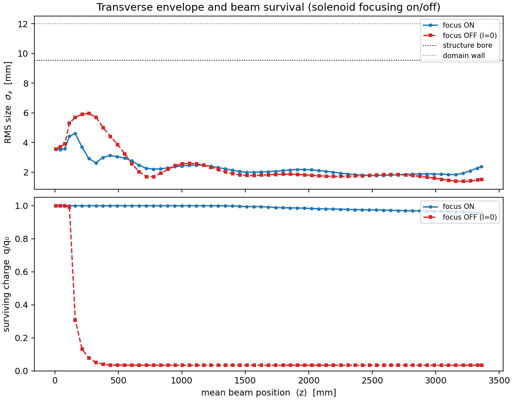

**Top:** RMS transverse size σ_r vs ⟨z⟩ with the structure bore (9.55 mm) and domain wall marked;
**bottom:** surviving charge fraction q/q₀. With the solenoid **ON** the diverging injected beam is
held inside the bore and ~95 % is captured (the q/q₀ panel stays near 1), then **adiabatically
damps** (σ_r ∝ 1/√(γβ), σ_x settling to ~2 mm as it accelerates). With focusing **OFF** the beam
expands and its surviving charge crashes to only the tight on-axis core (~3 %) within the first
~0.4 m — the focusing channel is what makes capture possible (a 28× difference in captured charge).

### `exit_spectrum_capture.png` — the output beam
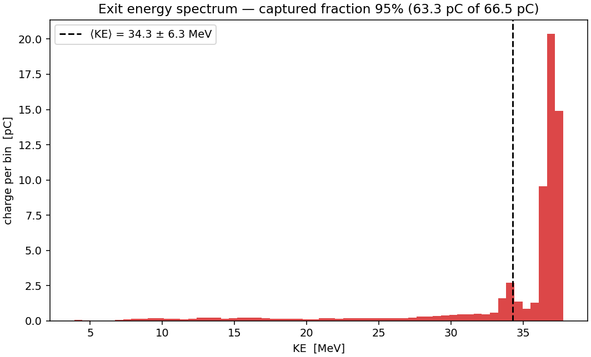

Charge-weighted exit energy spectrum (pC per bin) with the mean ± RMS marked, titled with the
captured-charge fraction (here 95 %, 63.3 of 66.5 pC). The captured bunch sits in a sharp peak near
~37 MeV — the core riding the crest — with a low-energy tail of off-crest captured particles that
pulls the mean to ⟨KE⟩ ≈ 34 ± 6 MeV.

### `phase_acceptance.png` — the acceptance curve
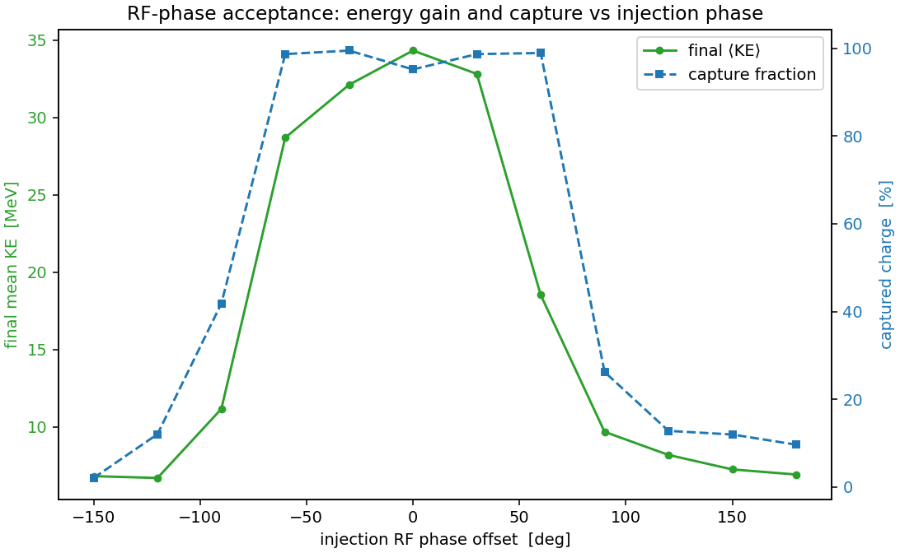

The RF-phase scan: final mean KE (left axis) and capture fraction (right axis) vs injection RF
phase offset. Both peak sharply at the **crest** (the operating point `demo()` selects for the
headline run) and collapse ~180° away — the structure accepts and accelerates the beam only over a
limited phase window. This is the classic linac injection-phase acceptance.
