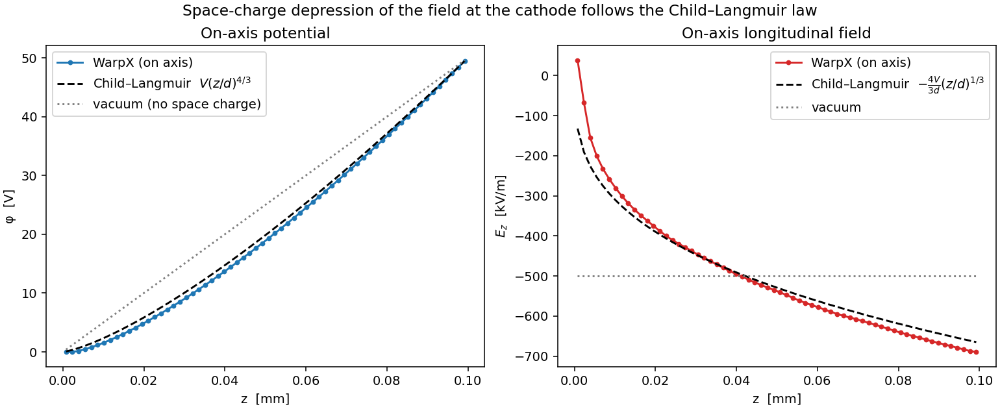
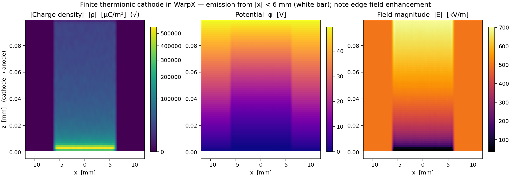
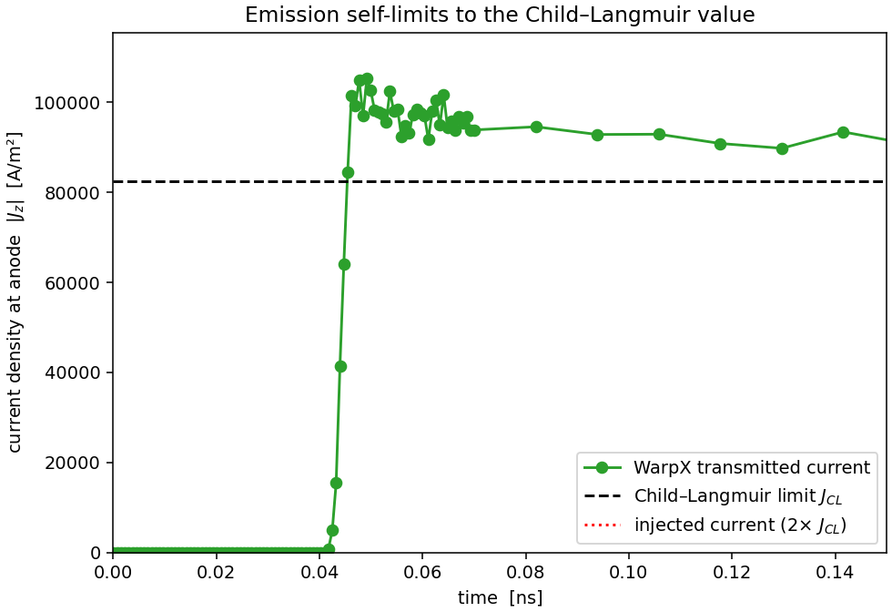
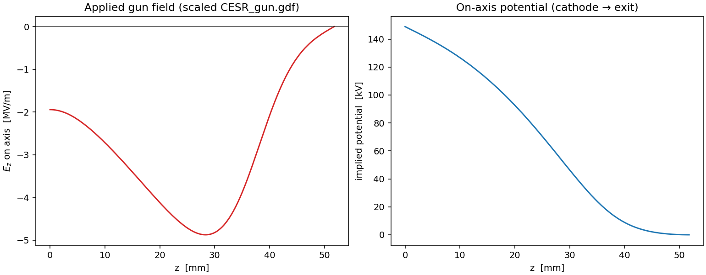
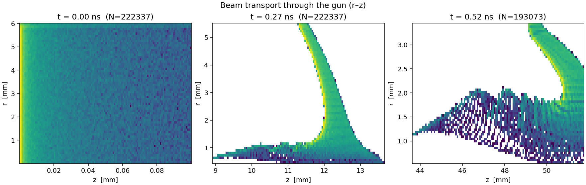
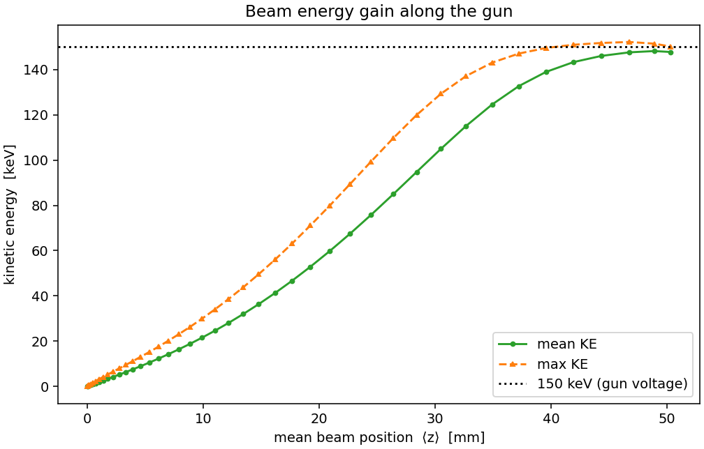
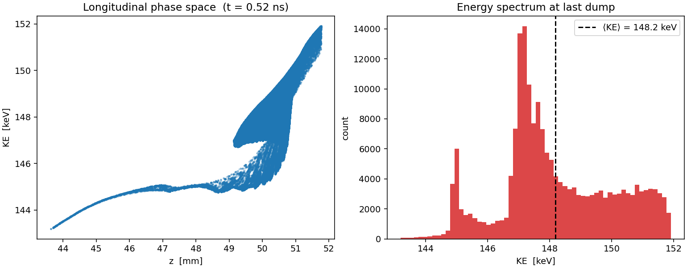
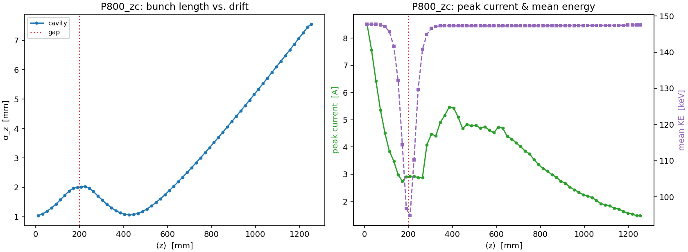
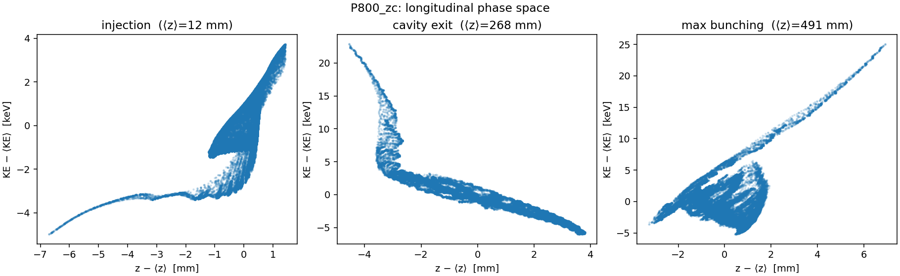

# Figures

A visual index of the result figures produced by each stage's `plot_*.py` script, with the
physics each one demonstrates. Every figure is written to its stage's `results/` directory by
reading that stage's `diags/` openPMD output — `results/` is git-ignored, so regenerate the PNGs
by re-running the plot script (or the full pipeline). The figures that *are* committed are added
explicitly with `git add -f warpx_<stage>/results/*.png`.

Regenerate everything:

```bash
conda activate CBB
python warpx_cathode/plot_cathode.py          # → warpx_cathode/results/
python warpx_gun/plot_gun.py                  # → warpx_gun/results/
python warpx_prebuncher/plot_prebuncher.py    # → warpx_prebuncher/results/ (all P* cases)
```

The chain is order-dependent — each stage accelerates/transports the previous stage's beam:

```
cathode  ─►  gun  ─►  prebuncher
(SCL diode)  (~148 keV)  (RF bunching)
```

---

## 1. Cathode — `warpx_cathode/results/`

Finite-extent, space-charge-limited (Child–Langmuir) diode in **2D x–z**: cathode plane at
`z = 0` (0 V), anode at `z = d = 4 mm` (+500 V), electrons emitted only from the finite patch
`|x| < 6 mm`. The run deliberately **over-injects at 2× J_CL** and lets the self-consistent
fields do the limiting — the answer is not imposed. Produced by `plot_cathode.py`.

### `child_langmuir.png` — the validation


On-axis (center of the cathode) potential `φ(z)` and longitudinal field `E_z(z)` from WarpX,
overlaid with the 1D planar Child–Langmuir laws `φ = V(z/d)^{4/3}`,
`E_z = −(4V/3d)(z/d)^{1/3}` and the vacuum (no-space-charge) linear reference. The WarpX curve
sits right on the 4/3-power potential, and the field is **driven to ≈0 at the cathode** instead
of uniform — the defining signature of space-charge-limited emission (the virtual cathode
reflecting excess current).

### `cathode_2d.png` — the 2D structure


Three side-by-side 2D maps across the gap: charge density `|ρ|` (√/PowerNorm scale), potential
`φ`, and field magnitude `|E|`. The white bar marks the emitting cathode patch (z = 0,
`|x| < 6 mm`). You can see (1) the dense space-charge / virtual-cathode layer hugging the
emitting strip, (2) the potential depression in the beam column, and (3) **bright field
enhancement at the cathode edges** `x = ±6 mm`, where the equipotentials crowd — a genuinely
2D effect with no counterpart in the planar theory.

### `current_saturation.png` — self-limiting emission


Transmitted current density at the anode vs. time (integrated across the beam, referenced to the
cathode width `2R`). Despite injecting **2× J_CL** (dotted line), the transmitted current ramps
up during gap-fill and then saturates near `J_CL` (dashed, ≈ 1630 A/m²; ≈87% in this run — the
small deficit is transverse spreading and edge losses in the finite 2D geometry). The cathode
does **not** pass the current it is fed; space charge regulates it. Linear y-axis anchored at the
origin so both the turn-on ramp and the plateau-vs-`J_CL` are visible to scale.

### `rho_z_time.png` — space-charge cloud build-up


On-axis charge density `|ρ|(z, t)` (√ scale) over the turn-on transient — the space-charge cloud
building up and filling the gap (gap-fill ≈ 480 steps). Time sampling is non-uniform (dense
through the transient, sparse in steady state), so it is drawn with `pcolormesh` on the true time
coordinates rather than `imshow`, which would distort the time axis.

---

## 2. Gun — `warpx_gun/results/`

CESR electrostatic gun ("Chili Gun Mk II", ~150 kV) in **RZ**, using the Poisson–Superfish field
map `CESR_gun.gdf` scaled to a −150 kV cathode. The gun field is applied as an external electrode
field; WarpX supplies the self-consistent space charge on top. The injected beam is the cathode
exit phase space, slab→radius remapped and renormalized to a 0.1 nC bunch. Produced by
`plot_gun.py`.

### `gun_field.png` — the accelerating field


Left: on-axis applied field `E_z(z)` (MV/m) of the scaled `CESR_gun.gdf` map — negative
(accelerating in +z), `≈ −1.94 MV/m` at the cathode and peaking `≈ −4.88 MV/m` near z ≈ 28 mm.
Right: the implied on-axis potential `V(z) = −∫E_z dz` (cathode → exit), a total ~150 kV drop.
This is the field the beam sees.

### `beam_rz.png` — transport through the gun


`r–z` 2D histograms (log color) of the beam at three snapshots — launch, mid-gun, exit — showing
transport through the gun, including the near-cathode radial focusing as the beam accelerates.

### `energy_gain.png` — energy gain along the gun


Mean and max kinetic energy of the beam vs. mean position `⟨z⟩`, climbing toward the 150 keV
gun-voltage line (dotted). The gain tracks `∫ e·|E_z| dz` (≈ 7.5 keV by z ≈ 4 mm), reaching the
full ~150 keV set by the cathode→exit potential drop.

### `exit_phase_space.png` — exit beam


Left: longitudinal phase space (`z` vs. `KE`) at the last dump. Right: the final energy spectrum
(histogram) with `⟨KE⟩` marked — a narrow distribution at ~148 keV, the beam handed off to the
prebuncher.

---

## 3. Prebuncher — `warpx_prebuncher/results/`

CESR standing-wave RF prebuncher (214 MHz TM cavity) in **RZ** that velocity-bunches the gun's
exit beam (~148 keV, β ≈ 0.63, 0.1 nC) in the downstream 1.3 m drift. Because the bunch is
already short and space-charge dense, the honest metric is bunching **relative to a drift-only
baseline** (`P = 0`): `σ_z,drift(z) / σ_z,cavity(z)`. Produced by `plot_prebuncher.py`, which
writes a `*_line.png` and `*_phasespace.png` for **every** `diags/P*` case directory present,
plus a cross-case `compare_power_phase.png` when a baseline or multiple cases exist.

Case names are `P<power>_<phase>`: `<phase>` is `zc` (zero-crossing → ballistic bunching) or
`crest` (max energy gain, little bunching); `P0_drift` is the drift-only baseline.

### `P800_zc_line.png` — bunch length, current, energy


For one case (here 800 W zero-crossing). **Left:** bunch length `σ_z(z)` for the cavity run vs.
the interpolated drift baseline (`k--`), with the max-bunching point starred
(`σ_drift/σ_cavity`, ≈ 5.4× for this case) and the cavity gap marked. The drift beam expands
0.985 → ~19 mm over the line; the cavity suppresses this and reaches a transient focus.
**Right:** peak current `I_peak(z)` and mean `KE(z)` along the line on twin axes.

### `P800_zc_phasespace.png` — the chirp flipping through the cavity


Mean-subtracted longitudinal `z–KE` phase space at three points: injection, cavity exit, and max
bunching. The gun beam arrives with an intrinsic **+1.40 keV/mm** (debunching) chirp; the
zero-crossing cavity adds a negative chirp, flipping the net slope and rotating the distribution
so it compresses downstream. (On-crest cases, by contrast, mostly shift up in energy without a
chirp flip — visible by comparing a `crest` phasespace figure.)

### `compare_power_phase.png` — scan summary *(when present)*
A cross-case figure written only when several cases / the drift baseline have been run (e.g. via
`run_scan.py` or repeated `prebuncher_sim.py` runs). **Left:** `σ_z(z)` for the drift baseline
vs. each zero-crossing power. **Right:** max bunching `σ_drift/σ_cavity` vs. RF power, for the
zero-crossing and on-crest phases. (Not committed in the current tree — regenerate by running
multiple powers; see `warpx_prebuncher/README.md`.)

`plot_prebuncher.py` also prints a summary table to stdout for every case (σ_z0, σ_z,min,
bunching factor, focus z, I_peak, final KE).
