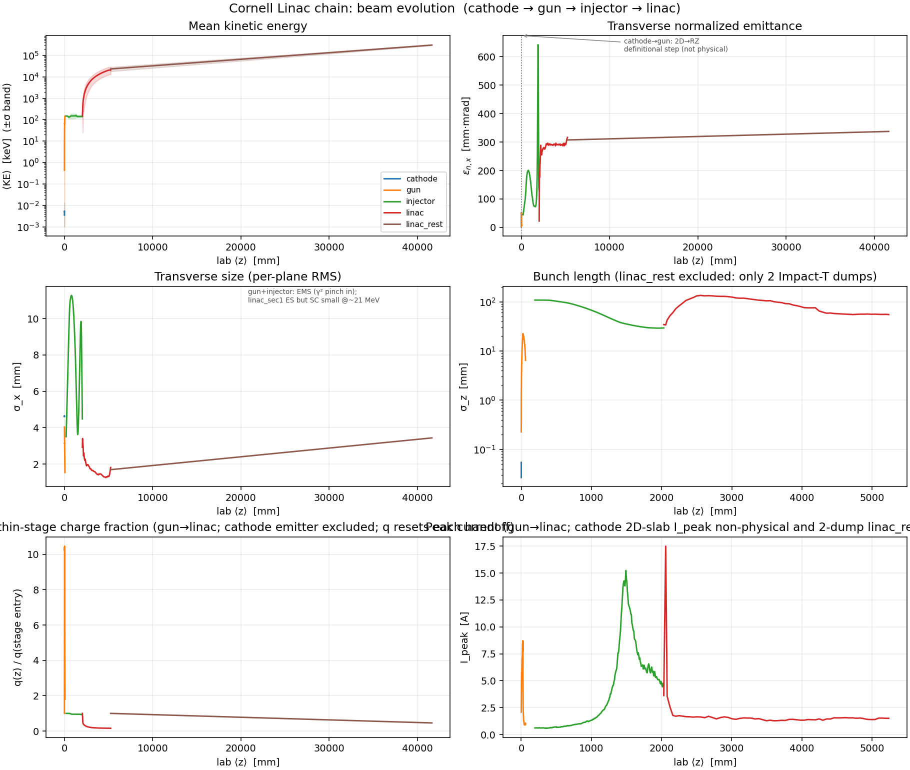
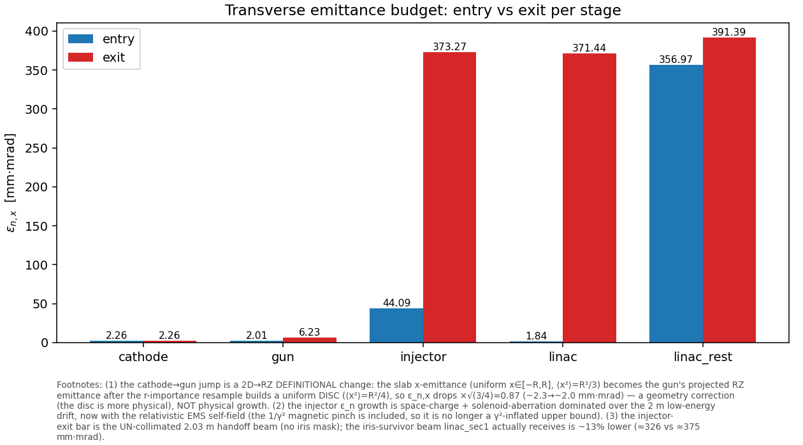
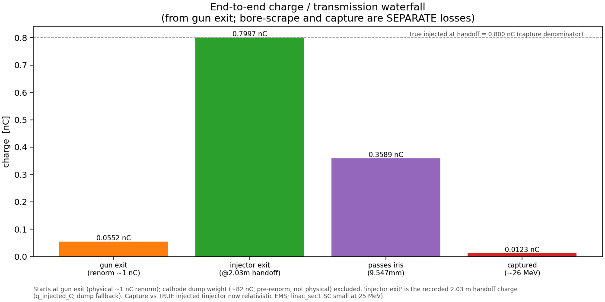
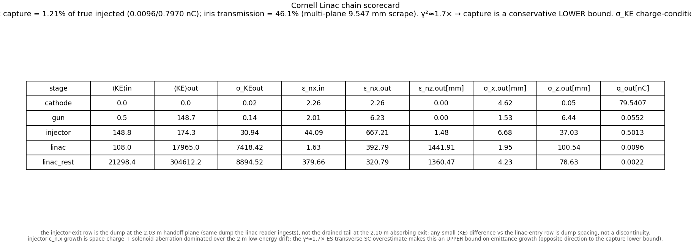
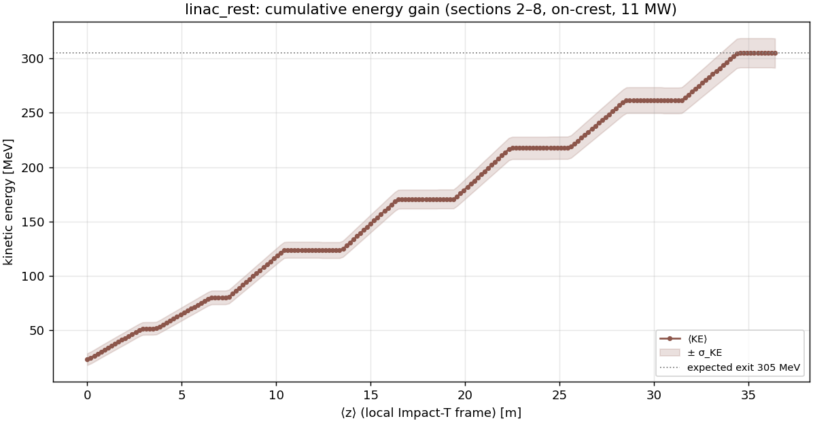
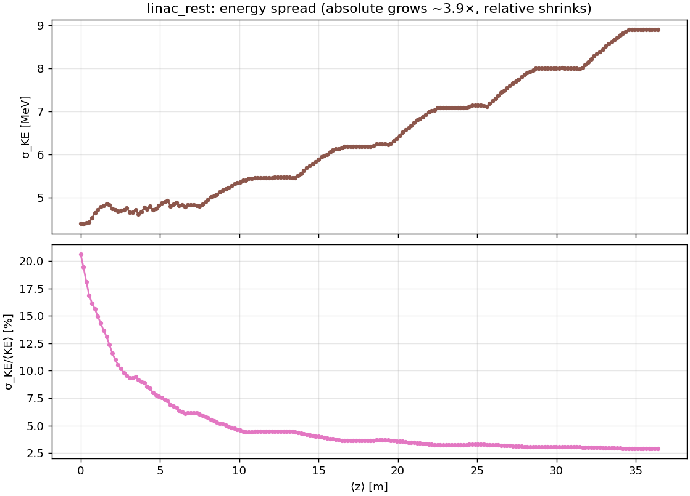
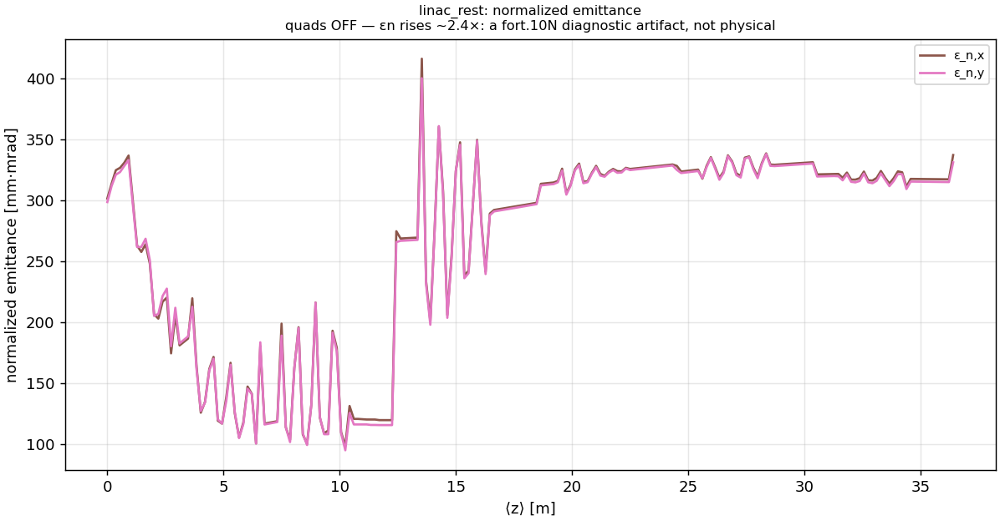
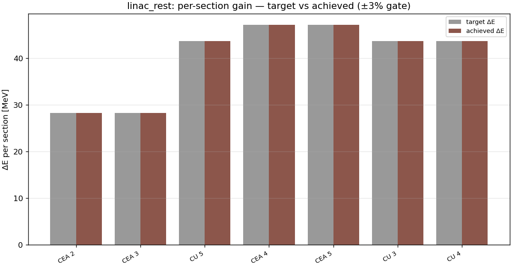
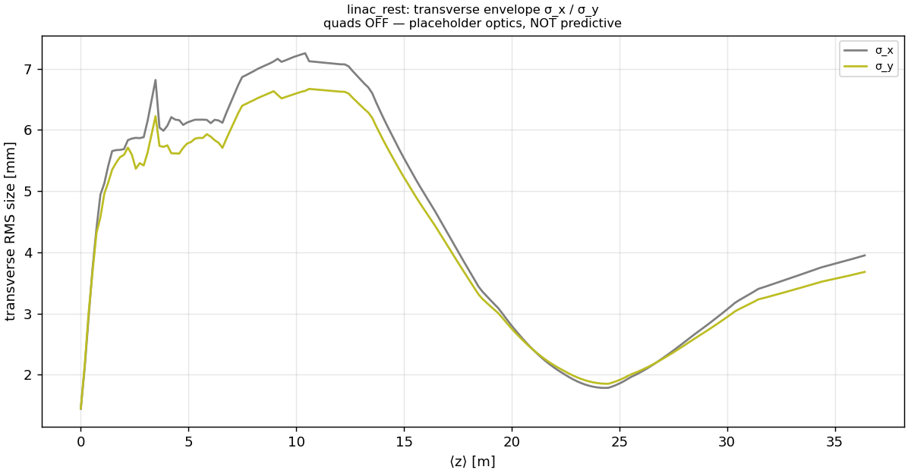
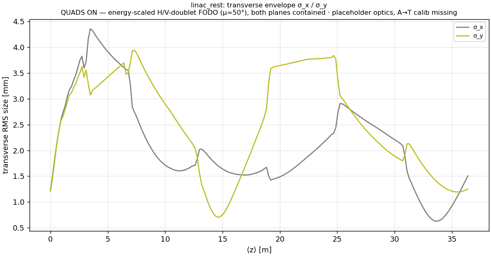

# Figures

A visual index of the result figures produced by each stage's `plot_*.py` script, with the
physics each one demonstrates. Every figure is written to its stage's `results/` directory by
reading that stage's `diags/` openPMD output — `results/` is git-ignored, so regenerate the PNGs
by re-running the plot script (or the full pipeline). The figures that *are* committed are added
explicitly with `git add -f <stage>/results/*.png`.

Regenerate everything:

```bash
conda activate CBB
python -c "import cathode; cathode.plot()"        # → cathode/results/
python -c "import gun; gun.plot()"                # → gun/results/
python -c "import injector; injector.plot()"      # → injector/results/ (diags/main + any P* scan)
python -c "import linac_sec1; linac_sec1.plot()"  # → linac_sec1/results/
python -c "import linac_rest; linac_rest.plot()"  # → linac_rest/results/
python -c "import pipeline; pipeline.plot_chain()"  # → results/ (cross-stage)
```

(Each `plot_*.py` is also runnable directly via `python <stage>/plot_<stage>.py` — the package
facade is just the preferred entry point.) The repo-root `results/` is git-ignored by the existing
`results/` pattern — its cross-stage PNGs are committed with `git add -f results/*.png`.

> **Profile note.** The four WarpX stages are driven via **lume-warpx** from their `<stage>.yaml`
> configs, whose shipped defaults are the **Balanced** performance profile. The figures are
> generated entirely with lume-warpx's `WarpX.plot2D` / `plot_fields` / `plot1D` helpers; edit the
> YAML to retune. The headline numbers (beam energies, bunching, capture) are set by the field maps
> and the inter-stage beam, not the solver fidelity.

The chain is order-dependent — each stage accelerates/transports the previous stage's beam:

```
cathode  ─►  gun  ─►  injector  ─►  linac_sec1  ─►  linac_rest
(SCL diode)  (~149 keV)  (2 prebunchers + 3 solenoids)  (~21 MeV captured)  (sections 2–8, ≈305 MeV)
```

---

## 0. Cross-stage — `results/`

`pipeline/plot_chain.py` (`pipeline.plot_chain()`) reads every stage's openPMD series, builds one
per-dump moment table per stage, and renders four figures into the **repo-root `results/`** —
the whole-chain view. Called automatically at the end of `pipeline/run_pipeline.py`.

### `chain_evolution.png` — beam moments vs lab ⟨z⟩

3×2 panels across cathode→gun→injector→linac vs lab ⟨z⟩: ⟨KE⟩ (±σ band, log-y), ε_n,x, σ_x,
σ_z (log-y), within-stage charge fraction, and I_peak. The σ_z and I_peak panels **exclude
`linac_rest`** (Impact-T writes only two particle dumps — injected core + exit — so its trace
would be a meaningless 2-point line across the ~30 m span; its endpoint values stay on the
KE/ε/σ_x/charge panels). **Caveats baked into the figure:** the
**cathode→gun ε_n,x step is a 2D→RZ definitional discontinuity** (the cathode is 2D x–z, slab
x-emittance ⟨x²⟩=R²/3; the gun's disc resample gives ⟨x²⟩=R²/4 ⇒ ε_n,x ×√(3/4)≈0.87) — annotated,
not physical growth. The σ_x / capture caveat that the lab-frame ES self-field overestimates
transverse SC by ~γ²≈1.7× (a conservative lower bound) is noted on the σ_x panel.

### `emittance_budget.png` — ε_n,x entry vs exit per stage

A waterfall of transverse normalized emittance at each stage's entry vs exit — which stage degrades
beam quality. The cathode→gun bar carries the 2D→RZ definitional footnote; a further footnote line
notes the injector-exit bar is the **un-collimated** 2.03 m handoff beam (no iris mask); the
iris-survivor beam `linac_sec1` actually receives is ~13 % lower (≈326 vs ≈375 mm·mrad).

### `transmission_waterfall.png` — the two-loss charge chain

gun exit → injector exit (@2.03 m handoff) → **passes iris** (9.547 mm, ~64%) → **captured** (~21 MeV, ~10%).
The bore-scrape and the RF-capture losses are **separate bars** — the separation that motivates the
upstream solenoids. Starts at gun exit (physical ~1 nC renorm); the cathode's raw macroparticle
weight is excluded (not a physical charge). The injector-exit bar reads the linac's **recorded**
handoff charge (`q_injected_C` from `linac_sec1`'s `injection_summary.json`; the 2.03 m dump is
the fallback for old runs without the sidecar), so it shares one source with the iris/captured
bars. Capture is vs the **true injected charge**.

### `chain_scorecard.png` — per-stage entry/exit table

Per-stage entry/exit ⟨KE⟩, σ_KE, ε_n,x, σ_x, σ_z, charge, and the end-to-end capture (vs true
injected). σ_KE is **charge-conditional** (a single-snapshot value), and the capture is the
γ²-conservative lower bound. Also printed to stdout/log. (Longitudinal ε_n,z, where reported, is
the z–(γβ_z) emittance in mm — NOT mm·mrad.)

---

## 1. Cathode — `cathode/results/`

Finite-extent, space-charge-limited (Child–Langmuir) diode in **2D x–z** (cathode 0 V, anode +30 V
at z = 0.2 mm, emission from `|x| < 8 mm`, over-injected at 2× J_CL). `plot_cathode.py` generates
three layers — lume-warpx's `WarpX.plot2D` / `plot_fields` / `plot1D` helpers, the shared
`pipeline.plot_extras` beam figures, and the stage-specific emission-physics figures (raw openPMD):

- `phase_space_z_KE.png` — `plot2D("z","kinetic_energy")`: longitudinal phase space of the beam
  streaming across the gap toward the anode.
- `transverse_x_px.png` — `plot2D("x","px")`: transverse phase space carrying the source's thermal emittance.
- `potential_xz.png` — `plot_fields("phi","x","z")`: gap potential, depressed in the beam column
  (the space-charge / virtual-cathode signature).
- `charge_density_xz.png` — `plot_fields("rho","x","z")`: the space-charge layer hugging the emitting strip.
- `centroid_vs_t.png` — `plot1D("t","mean_z")`: the emitted cloud filling the gap.
- `charge_vs_t.png` — `plot1D("t","charge")`: total tracked charge as emission self-limits at J_CL.
- `energy_spectrum.png` — `plot_extras.energy_spectrum`: charge-weighted KE histogram with ⟨E⟩/σ_E — the broad low-energy emitted spectrum across the gap.
- `current_profile.png` — `plot_extras.current_profile`: longitudinal current I(z) = Σ(w·v_z)/dz — the flat continuous-DC emission stream (the SCL diode emits a steady current, not a bunch).
- `child_langmuir.png` — on-axis φ(z) and E_z(z) against the planar Child–Langmuir law and the vacuum reference: the field is space-charge-depressed below vacuum and tracks the CL z^(4/3)/z^(1/3) shape (with the near-cathode field reversal, the virtual-cathode signature).
- `current_saturation.png` — transmitted current density at the anode vs time: space charge holds it toward J_CL even though 2× J_CL is injected.
- `emission_phase_space.png` — the intrinsic thermal transverse phase space (x, p_x) hexbin + p_x histogram with ε_n,x and the ±√(kT·mₑc²) thermal scale: the source quality the gun inherits.

---

## 2. Gun — `gun/results/`

CESR electrostatic gun ("Chili Gun Mk II", ~150 kV) in **RZ**, using the Poisson–Superfish field
map `CESR_gun.gdf` scaled to a −150 kV cathode (applied electrode field + self-consistent space
charge; the cathode beam is slab→radius remapped, renormalized to 1 nC, and time-released over the
2 ns grid pulse). `plot_gun.py` generates three layers — lume-warpx's helpers, the shared
`pipeline.plot_extras` beam figures, and the stage-specific rich figures (raw openPMD):

- `phase_space_z_KE.png` — `plot2D("z","kinetic_energy")`: the exit longitudinal phase space, the
  beam accelerated to ~150 keV.
- `transverse_x_px.png` — `plot2D("x","px")`: the exit transverse phase space.
- `Ez_rz.png` — `plot_fields("E","z","r")`: the field in the gun gap (applied electrode + self-field).
- `self_charge_rz.png` — `plot_fields("rho","z","r")`: the beam self charge density.
- `centroid_vs_t.png` — `plot1D("t","mean_z")`: the bunch marching down the gun.
- `emittance_vs_t.png` — `plot1D("t","norm_emit_x")`: normalized transverse emittance over the run.
- `beamsize_vs_t.png` — `plot1D("t","sigma_x")`: the transverse envelope σ_x across the gun.
- `energy_spectrum.png` — `plot_extras.energy_spectrum`: charge-weighted exit KE histogram with ⟨E⟩/σ_E — the ~150 keV beam's energy spread.
- `current_profile.png` — `plot_extras.current_profile`: longitudinal current I(z) of the time-released 2 ns pulse stream.
- `beam_spot_xy.png` — `plot_extras.beam_spot`: the transverse x–y spot (RZ-reconstructed y) with marginals — a roundness check.
- `gun_field.png` — the on-axis applied E_z(z) and the potential it implies (cathode → exit), read from `gun_E.h5`.
- `beam_rz.png` — the beam shape in r–z at launch / mid-gun / exit (id-tracked volumetric dumps).
- `energy_gain.png` — mean and max KE vs z on **fixed-z virtual screens** (`beam_metrics.screen_profile`): a local-in-z energy gain saturating at the 150 keV gun voltage, with no quasi-DC pooling jitter.
- `beam_envelope.png` — σ_x and ε_n,x vs z on the same virtual screens: the transverse focusing (σ_x ~4→1.3 mm) and emittance evolution.
- `space_charge.png` — the beam **self-field** ρ(r,z) and φ(r,z) (the dumped self-consistent fields) near launch, separate from the applied gun field.

---

## 3. Injector — `injector/results/`

The full LinacSim injector subsection in **one RZ** space-charge run: Lens 0A → Prebuncher 1
(8 kW @ 0.534 m) → Prebuncher 2 (10 kW, reversed, @ 1.318 m) → Sol 0 / Lens 0E, then the 9.547 mm
collimator. Two-cavity velocity bunching + solenoid focusing over ~2 m; hands a focused, collimated
beam to the linac at z ≈ 2.03 m. `plot_injector.py` generates three layers — lume-warpx's helpers,
the shared `pipeline.plot_extras` beam figures, and the stage-specific rich figures (raw openPMD):

- `injector_phase_space_z_KE.png` — `plot2D("z","kinetic_energy")`: the exit longitudinal phase
  space — the energy-flat (~150 keV, zero net kick) velocity-bunched beam at the 2.03 m handoff.
- `injector_transverse_x_px.png` — `plot2D("x","px")`: the exit transverse phase space (solenoid focused).
- `injector_centroid_vs_t.png` — `plot1D("t","mean_z")`: the bunch traversing the ~2 m line.
- `injector_bunch_length_vs_t.png` — `plot1D("t","sigma_z")`: σ_z compressing to its waist at the handoff.
- `injector_emittance_vs_t.png` — `plot1D("t","norm_emit_x")`: transverse emittance over the run.
- `injector_beamsize_vs_t.png` — `plot1D("t","sigma_x")`: the transverse envelope σ_x — the solenoid (Sol 0 / Lens 0E) focusing.
- `injector_energy_spectrum.png` — `plot_extras.energy_spectrum`: charge-weighted handoff KE histogram — the energy-flat (~150 keV, zero net kick) spectrum.
- `injector_current_profile.png` — `plot_extras.current_profile`: longitudinal current I(z) — the velocity-bunched peak at the waist.
- `injector_energy_chirp.png` — `plot_extras.energy_chirp`: slice ⟨KE⟩ vs z (with density) — the longitudinal energy chirp that drives the velocity bunching.
- `injector_beam_spot_xy.png` — `plot_extras.beam_spot`: the transverse x–y spot (RZ-reconstructed y) with marginals.
- `injector_cavity.png` — the on-axis E_z field lobes of both prebunchers (scaled by their drive amplitude V_g), in lab z, with the 2.03 m handoff plane marked.
- `injector_line.png` — σ_z, peak current, and mean KE vs ⟨z⟩ along the line: the velocity-bunching story (σ_z 108→27 mm, peak current → ~16 A) with the energy modulation at each cavity gap.
- `injector_bunch_profile.png` — the longitudinal line-charge density λ(z) at four stations (injection / after Preb 2 / best focus / handoff).
- `injector_phasespace.png` — the charge-weighted longitudinal phase space (z−⟨z⟩, KE−⟨KE⟩) at the same four stations: the chirp imposed by the cavities rotating to the bunched S-curve at the waist.

---

## 4. Linac Section 1 — `linac_sec1/results/`

SLAC-design 3 m, 86-cell, **2π/3 traveling-wave** accelerating structure in **RZ** (f = 2856 MHz),
synthesised from the two quadrature field maps and driven at the original LinacSim **P = 11 MW**.
**No in-stage solenoid** — focusing is upstream in the injector. The linac reads the injector's
focused beam at the **z ≈ 2.03 m handoff** and applies the **multi-plane 9.547 mm iris scrape** at
injection (at the real 1.922 m iris plane; the beam converges through the tail, so a single 2.03 m
cut would overstate transmission). At the faithful currents the Sol 0 / Lens 0E matching telescope
focuses ~64 % of the handoff charge through the 9.547 mm iris, and the linac captures **~10 % of the
true injected charge** to ⟨KE⟩ ≈ 21 MeV (max ~32 MeV). Produced by `plot_linac_sec1.py` from the run (`diags/main`) at
`PHASE_DEG = 0`. Capture is a **conservative γ²≈1.7× lower bound** (real machine captures more),
tune-sensitive to the upstream lens currents, and reported against the **true injected charge**
(sidecar `injection_summary.json`), not the post-collimation first dump.

`plot_linac_sec1.py` generates every figure with lume-warpx's helpers (particle diagnostics only —
no field diag, so no `plot_fields`):

- `linac_sec1_phase_space_z_KE.png` — `plot2D("z","kinetic_energy")`: the exit longitudinal phase
  space — the captured slice at ⟨KE⟩ ≈ 21 MeV (a broad ~5–32 MeV spread, only a phase slice locks
  to the crest).
- `linac_sec1_transverse_x_px.png` — `plot2D("x","px")`: the exit transverse phase space within the
  9.547 mm bore.
- `linac_sec1_centroid_vs_t.png` — `plot1D("t","mean_z")`: the bunch crossing the 3 m structure + drift.
- `linac_sec1_emittance_vs_t.png` — `plot1D("t","norm_emit_x")`: transverse emittance over the run.

---

## 5. Linac sections 2–8 (Impact-T) — `linac_rest/results/`

The rest of the straight electron line to CHESS: seven S-band traveling-wave sections
(CEA 2/3/4/5 + CU 3/4/5) run as one Impact-T deck, accelerating the captured ~21 MeV core
on-crest to ≈305 MeV at the faithful 11 MW point (304.9 MeV survivors through the real bore;
305.2 MeV full-beam — the bore scrapes lower-energy off-axis particles). Field shape reuses the
lume-impact `rfdata4–7` TW template (shape only); all per-section physics is in the calibrated
scale. Space charge OFF by default (γ > 49); quads present at real lengths but OFF (K1 = 0) for the
headline. The vs-z panels come from Impact-T's continuous `I.stat(...)` arrays. See
`linac_rest/README.md`.

### `energy_gain.png` — cumulative energy to ≈305 MeV


⟨KE⟩ (with the ± σ_KE band) vs ⟨z⟩ across the seven sections — the on-crest cumulative rise
from the ~21 MeV captured core to ≈305 MeV at 11 MW (each section calibrated to its
ΔE_target = ΔE_table·√(P/15)). The expected exit energy (measured ⟨KE⟩_in + Σ ΔE_target) is
marked.

### `energy_spread.png` — absolute σ_KE grows (~3.9×), relative shrinks


**Top:** absolute σ_KE vs ⟨z⟩ — **NOT** conserved; it grows ~3.9× (5.42 → 21.21 MeV) from the
second-order crest curvature accumulated over the seven on-crest sections (a finite-phase-length
bunch sits on an energy maximum). **Bottom:** relative spread σ_KE/⟨KE⟩ still shrinks
(≈20.0 % at injection → ≈6.9 % at exit) because ⟨KE⟩ grows faster (~11.4×) than σ_KE. See
`linac_rest/README.md` §5 gate 3 / `calibration.py`.

### `emittance.png` — normalized emittance (headline, quads OFF)


Normalized RMS emittance ε_n,x / ε_n,y vs ⟨z⟩. With quads OFF (RF + drift only) it is
near-conserved; the panel flags any numerical growth. Quad-ON emittance is exploratory and
never the headline.

### `section_gains.png` — per-section target vs achieved ΔE


Bar chart of each section's calibrated achieved ΔE against its √P-scaled target — the §5
gate-1 visual (±3 % per section). Read from the calibration table in `injection_summary.json`.

### `fodo_optics.png` — transverse envelope σ_x / σ_y


σ_x **and** σ_y vs ⟨z⟩, titled (and **filenamed**) by the quad state — the plot script writes
`fodo_optics.png` for quads OFF and `fodo_optics_quadson.png` for `QUADS_ON`, so a quads-ON run
never overwrites this quads-OFF headline figure. With quads OFF (default) this is
**placeholder optics — NOT predictive** (the beam diverges, no focusing). (QUADS_ON numbers
below are from an earlier quads-ON run on the snapshot operating point and have NOT been
re-baselined to the current timed-beam run, whose quads-OFF transmission is 46.0 %.) With `QUADS_ON` it
shows the **derived energy-scaled FODO**'s **contained, bounded, out-of-phase oscillating**
σ_x/σ_y envelope — both transverse planes held to ≈ 0.6–4.4 mm RMS over the full 36 m (no
blow-up), the doublet's win. Each gap is a real **H/V doublet** (two opposite-sign `qL/2` halves
back-to-back, net-focusing in *both* planes), per-cell nominal μ = 50°, gradients alternating-sign
and energy-scaled by the local Bρ. Still **placeholder optics**: the K1 are derived from
constant-phase-advance FODO design, NOT measured quad current (the A→T calibration is undocumented),
and the inter-quad multi-metre RF section is treated as a thin-lens drift (so μ is nominal, not
realized). The deliverable is the **bounded envelope**, NOT transmission — transmission lands ≈ the
quads-OFF baseline (~78.2 %), never a "> 78.5 %" or predictive-transmission claim. The committed
`fodo_optics.png` is the **quads-OFF** state (the headline default the pipeline produces); the
`QUADS_ON` proof is written to `fodo_optics_quadson.png` (below).

### `fodo_optics_quadson.png` — QUADS_ON proof: contained both-plane envelope


The single committed **`QUADS_ON`** artifact, demonstrating the working focusing the headline run
(quads OFF) cannot show: the μ = 50° **H/V-doublet** FODO holds **both** transverse planes bounded
and out of phase (σ_x ≈ 0.6–4.4 mm, σ_y ≈ 0.7–3.9 mm over the full 36 m, oscillating — no blow-up),
while the longitudinal headline is preserved (exit ⟨KE⟩ ≈ 309 MeV, gates 1/2/5/6 PASS). Generated by
a one-off `linac_rest.config(QUADS_ON=True); linac_rest.run()` — the plot script writes this file
directly when quads are ON (the quads-OFF `fodo_optics.png` is untouched) — and force-added (the
default pipeline stays quads OFF). **Exploratory** — placeholder optics (guessed-K1 magnitude, A→T undocumented,
nominal μ); the deliverable is the contained σ_x/σ_y envelope, NOT a transmission claim
(transmission ≈ the quads-OFF baseline, ~78.2 %).
