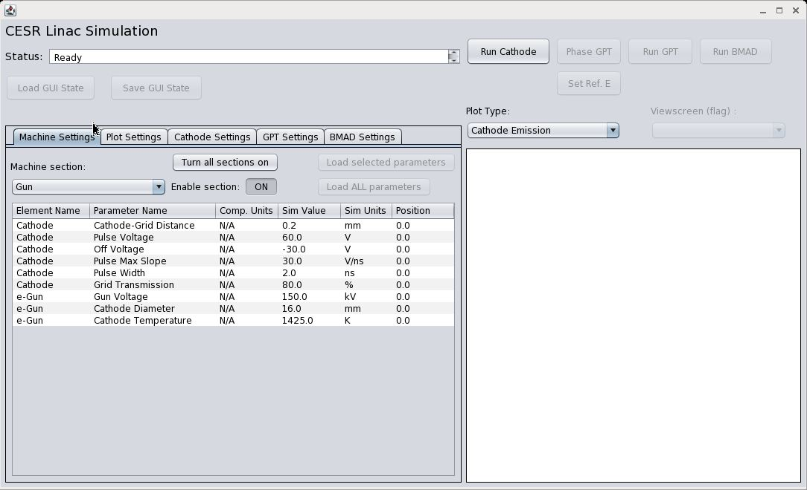

# Linac Simulation GUI

> **Author:** Adam Bartnik (acb20@cornell.edu), with Colwyn Gulliford  
> **Context:** CESR Linac at Cornell CLASSE / ERL injector project  
> **Simulation codes used:** GPT + BMAD (+ custom 1D cathode code in Java)

## Overview

During the development of the ERL injector, a GUI was needed to quickly predict beam properties during operation — both as a tuning guide and sanity check. Colwyn Gulliford laid the foundation in GPT by making accurate fieldmaps for all beamline optics. Together with Adam Bartnik, a user interface was assembled in Matlab to load machine settings, simulate them, and display results. After calibration and fine-tuning, remarkable agreement [between experiment and simulation](http://arxiv.org/abs/1304.2708) was achieved. The goal is to bring this accuracy to the CESR Linac.

### Simulation Goals

1. **Interface with the CESR control system** — load current/previous real machine settings
2. **High accuracy when required, faster methods when allowed:**
   - Use GPT to simulate space charge effects at low energy
   - Use BMAD for (much) faster simulations at high energy
3. **Use more flexible languages** — written in Java (replacing old Matlab code)

## Documentation

| Document | Description |
|----------|-------------|
| [Introduction](introduction.md) | How electron beams are simulated — physics and algorithms |
| [Technical Details](details.md) | Details on each subsystem: cathode, gun, prebunchers, lenses, linac cavities, quads |
| [User Guide](user_guide.md) | Using the GUI: buttons, parameters, plot settings |
| [To-Do List](todo.md) | Outstanding work and future directions |

## Three-Region Code Architecture

The simulation is divided into three regions with different approximations:

| Region | Method | Code | Physics |
|--------|--------|------|---------|
| Cathode → grid (~hundreds µm) | 1D charged sheets | Custom Java | Space charge dominant; Child-Langmuir regime |
| Gun → end of linac section 1 | 2D cylindrically symmetric PIC | GPT | Space charge via particle-in-cell |
| After section 1 → end of linac | 3D, no space charge | BMAD | High energy; space charge negligible |

The simulation currently ends before the electron snout; in principle it is straightforward to extend it to include the snout and existing BMAD models for the synchrotron and CESR.
