# Technical Details of the Simulation

## Cathode-to-Grid Region

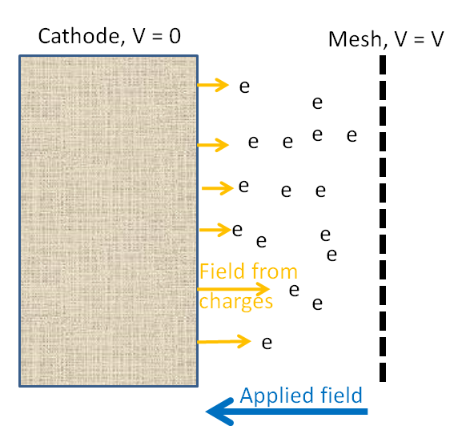

The cathode-grid region is effectively 1D because cathode diameter ≫ cathode-grid separation (2R ≫ L). Charges are modeled as infinitely wide sheets of surface charge density.

### Field Equations

The field from the i-th sheet in this region:

- To the **left** of the sheet: E_L
- To the **right** of the sheet: E_R

The total force on the n-th sheet (due to all others, with sheets sorted by z-position) can be written as a sum of background field (from the applied voltage) plus the field from all other sheets. In practice this is computed using cumulative sums of pre-computed arrays, making it efficient to code.

The transverse (radial) force on the sheets is neglected — since the total charge in the region (sheets plus surface charges on conductors) is exactly zero, the net transverse force vanishes within the 1D approximation.

### Voltage Pulse Model

The voltage pulse shape is parameterized as:

```
V(t) = Voff + Vpulse * f(t; Vp, t0)
```

where `Voff` is the bias voltage before/after the pulse, `Vpulse` is the peak voltage change, `Vp` controls the maximum slope, and `t0` sets the pulse width. The shape interpolates between a rounded square pulse and a rounded triangle pulse as `Vp` decreases.

**Simulation inputs:** cathode-grid distance, cathode diameter, cathode temperature (sets initial transverse velocity spread / emittance), pulse width, pulse height, off voltage, max voltage slope.

---

## Thermionic Gun

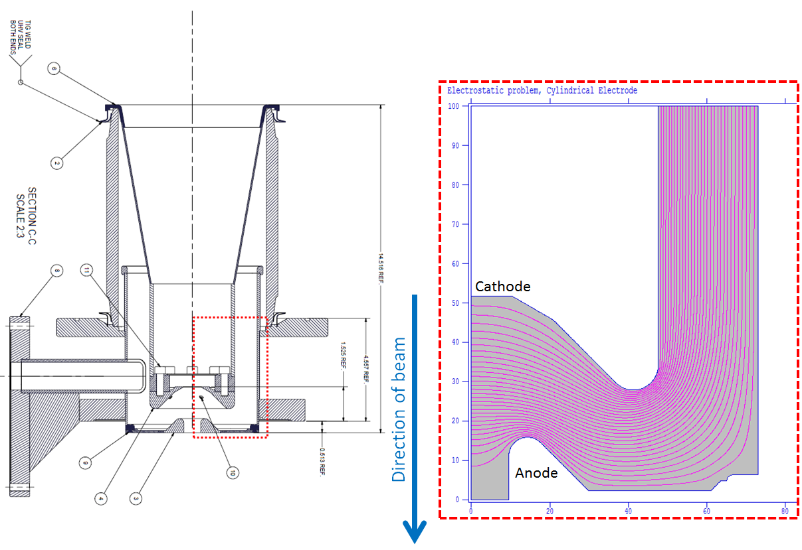

*Left: scan of gun drawings used to build the model. Right: equipotential lines from Poisson Superfish simulation. The simulation region is within the dotted red lines.*

The gun (Chili Gun Mk II) was modeled using [Poisson Superfish](http://laacg1.lanl.gov/laacg/services/download_sf.phtml) with cylindrical symmetry. The fieldmap was interpolated onto a regular grid only in the region the beam can reach (inside the beam pipe exit aperture).

Note: fields near the cathode focus the beam, while near the anode there is a small defocusing (less important since the beam is higher energy there).

**GPT input line example:**
```
!Map2D_E("wcs", "z", 0.0, "CESR_gun.gdf", "R", "Z", "Er", "Ez", gun_scaled_voltage);
```

**Supporting files:** `cesr_gun.am.txt` (Poisson input), `CESR_gun.gdf` (GPT fieldmap)

---

## Prebunchers

Both prebunchers share the same design (though different loaded Q values); the second is installed in reverse. They were modeled in CST Microwave Studio with cylindrical symmetry (couplers and HOM dampers neglected as a first pass).

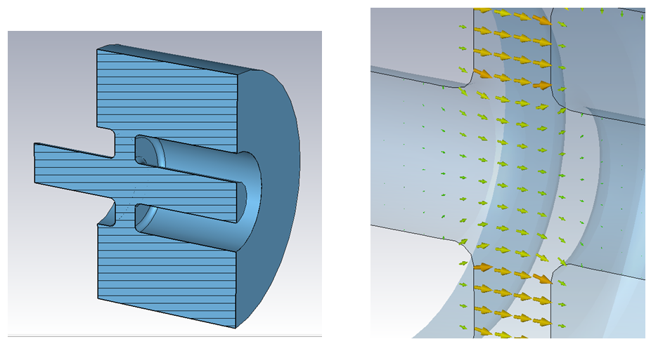
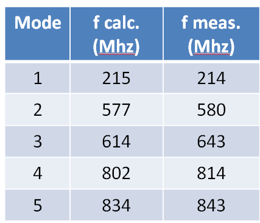

*Above: prebuncher cavity, fundamental-mode electric field, and calculated vs. measured mode frequencies.*

### Scaling

The user specifies dissipated power and relative phase. Field amplitude is derived from the **measured loaded Q** values (from 1991):
- Prebuncher 1: Q_L = 3000
- Prebuncher 2: Q_L = 4300

Frequency: 18 × (master RF). Reference: 42 × master RF = 499.7645 MHz (1991 measurement).

The fieldmap is normalized to 1 J stored energy and scaled in GPT:

```
prebuncher_sim_energy = 1;  # joules
prebuncher_energy = 1e3 * prebuncher_Q * prebuncher_input_power / (Prebuncher_RF * 2 * pi);
prebuncher_scale = sqrt(prebuncher_energy / prebuncher_sim_energy);
```

**GPT input lines (prebunchers 1 and 2):**
```
!Map25D_TM("wcs", 0,0,Z_prebuncher1,  1,0,0, 0,1,0, "prebuncher_25D.gdf", "R","Z","Er","Ez","H", prebuncher1_scale, 0, phi_prebuncher1_total, 2*pi*Prebuncher_RF);
!Map25D_TM("wcs", 0,0,Z_prebuncher2, -1,0,0, 0,1,0, "prebuncher_25D.gdf", "R","Z","Er","Ez","H", prebuncher2_scale, 0, phi_prebuncher2_total, 2*pi*Prebuncher_RF);
```

*(Note the `-1,0,0` direction vector for prebuncher 2, which is installed in reverse.)*

**Supporting files:** `cesr_prebuncher.cst` (Microwave Studio model), `prebuncher_25D.gdf` (GPT fieldmap)

---

## Solenoid Lenses

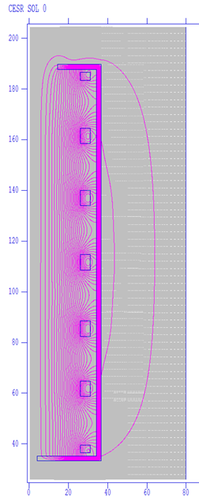 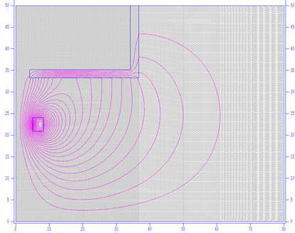

Solenoid lenses (Lens 0A–0E, Sol 0, Sol 1) were modeled in Poisson Superfish from schematics, including the nearby steel frame. Each solenoid is simulated at 1 A input current; GPT scales linearly from there.

The steel frame has four support bars (not cylindrically symmetric), but the cylindrically symmetric approximation is used since the bars don't meaningfully affect the field inside the beam pipe. Only the in-pipe field region was interpolated onto a regular grid.

**GPT input example (Sol 0):**
```
!Map2D_B("wcs", "z", 0.0, "SOL_0.gdf", "R", "Z", "Br", "Bz", current_sol0);
```

*(Placed at z = 0 because the position offset is already encoded in the data file.)*

**Status of Sol 1:** Not yet in the simulation. Inner radius 5.25", outer 8.75", full box length 111.75". Number of windings and exact coil spacing unknown (check schematics 6043-03, 60-64).

**Supporting files:** `lens_0A.am.txt` through `lens_0E.am.txt`, `SOL_0.am.txt`, `SOL_1.am.txt` (Poisson inputs); `LENS_0A.gdf` through `LENS_0E.gdf`, `SOL_0.gdf` (GPT fieldmaps)

---

## Linac Section 1 (SLAC-Design, "Chinese" Cavities)

The 86-cell, 3-meter SLAC traveling-wave cavity design is [well documented](http://www.slac.stanford.edu/library/2MileAccelerator/2mile.htm) since it is the same as the SLAC two-mile linac.

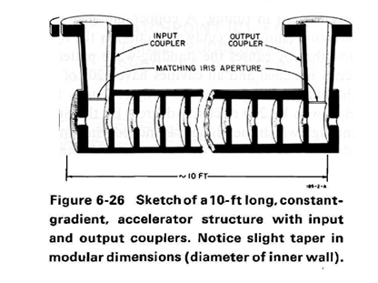 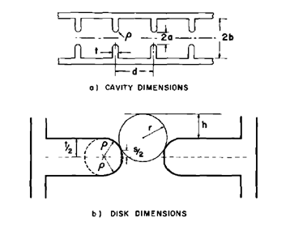
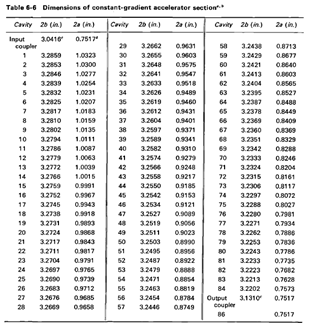

### Modeling Approach

A full 86-cell 3D model in Microwave Studio was too large for a typical PC. Instead, Poisson Superfish was used to model each cell individually assuming perfect periodic boundary conditions (following [1979](SLAC_Cavities_in_Superfish_-_1979.pdf) and [1985](SLAC_Cavities_in_Superfish_-_1985.pdf) SLAC papers). The fields from individual cells are then stitched together respecting the 2π/3 traveling-wave phase advance.

**Boundary conditions:** Superfish gives standing-wave solutions; the 2π/3 traveling-wave solution is constructed using a sampling trick from the SLAC papers, using either Dirichlet-Dirichlet or Neumann-Neumann boundary conditions on the 1.5-cell model.

**Field stitching:** Initially tried energy-conservation boundary matching (power into cell n+1 = power in cell n minus wall losses). This gave a slight unphysical gradient rise. Final approach: **force constant gradient** along the cavity length.

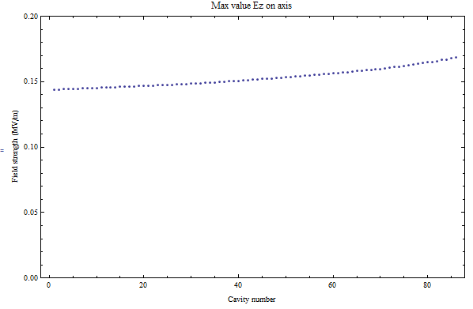

*Above: stitching with energy conservation. Below: forced constant gradient.*

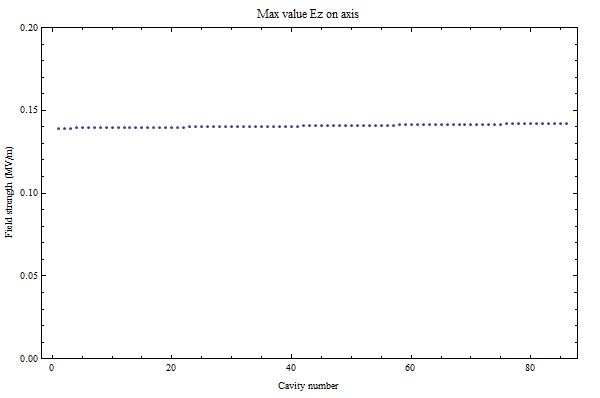

**Cell edge handling:** The first and last cells border the beam pipe. To avoid sharp field discontinuities (which cause GPT to be unhappy), a field that tapers over a few mm is faked at each end — too short to affect beam physics, long enough for GPT to integrate smoothly.

**Normalization:** Field is normalized to 1 kW input power. Scale in GPT:
```
linac1_scale = sqrt(sec1_input_power / linac1_sim_power);  # linac1_sim_power = 0.001 MW
```

**Traveling wave in GPT:** GPT only supports standing-wave cavities, so the traveling wave is represented as the sum of two standing waves π/2 out of phase:
```
!Map25D_TM("wcs", 0,0,2.03, 1,0,0, 0,1,0, "SLAC-3mLinac-field1.gdf", "R","Z","ErRe","EzRe","HphiIm", linac1_scale, 0, phi_sec1_total,          2*pi*Linac_RF);
!Map25D_TM("wcs", 0,0,2.03, 1,0,0, 0,1,0, "SLAC-3mLinac-field2.gdf", "R","Z","ErIm", "EzIm", "HphiRe", linac1_scale, 0, phi_sec1_total+0.5*pi, 2*pi*Linac_RF);
```

**Automation:** 86 Superfish runs and the field stitching were scripted in Mathematica (`AppendAllCavities.nb`). Post-processing (adding the tapered tails) is in `PostProcessing.nb`.

**Supporting files:** `AppendAllCavities.nb`, `PostProcessing.nb`, `default_grid.in7.txt`, `line_temp.in7.txt`, `default_line.in7.txt`, `SLAC-cavity-sizes.txt`, `SLAC-3mLinac-field1.gdf`, `SLAC-3mLinac-field2.gdf`

---

## Other Linac Sections (2–8)

Sections 2–8 are modeled in BMAD using its built-in linac function. Not field-accurate, but sufficient for high-energy beams where space charge is negligible.

### Cavity Parameters

| # | Type | Cells | L (m) | R (MΩ/m) | τ (nepers) | Bore (in) | Energy gain @ 15 MW |
|---|------|-------|-------|-----------|------------|-----------|---------------------|
| 1 | SLAC | 86 | 2.94 | 30 | 0.57 | 1.03–0.75 | 37 MeV |
| 2 | CEA 2 | 90 | 2.94 | 24 | 0.57 | 0.99–0.78 | 33 MeV |
| 3 | CEA 3 | 90 | 2.94 | 24 | 0.57 | 0.99–0.78 | 33 MeV |
| 4 | CU 5 | 149 | 4.97 | 34 | 0.57 | 1.16–0.92 | 51 MeV |
| 5 | CEA 4 | 155* | 5.15 | 40 | 0.57 | 1.16–0.92† | 55 MeV |
| 6 | CEA 5 | 155* | 5.15 | 40 | 0.57 | 1.16–0.92† | 55 MeV |
| 7 | CU 3 | 149 | 4.97 | 34 | 0.57 | 1.16–0.92 | 51 MeV |
| 8 | CU 4 | 149 | 4.97 | 34 | 0.57 | 1.16–0.92 | 51 MeV |
| e+ comp | CU 2 | 149 | 4.97 | 34 | 0.57 | 1.16–0.92 | 51 MeV |

*\* Cell count is a guess based on length.*  
*† Taken from Dan Fromowitz's code, not independently verified.*

---

## Quadrupole Magnets

All quads use BMAD's generic quad function. Not field-accurate, but correct physics with proper calibrations.

**Critical missing data:** Current-to-field (A → T) conversions are not known for any of the quads. Placeholder values with correct order of magnitude are used; actual measurements are needed.

### Quad Lengths (sources compared)

| Name | D. Dean (1985) | D. Fromowitz (2000) | Linac Survey (1996) | Used in simulation |
|------|----------------|---------------------|---------------------|--------------------|
| H/V Q1 | 14.375" from mag. ctr | N/A | 10.5" total | 10.5" = 4.8+0.9+4.8 |
| H/V Q2 | 11" = 4+3+4 | N/A | 11.0" total | Dean's values |
| H/V Q3 | 18" = 6+6+6 | N/A | 18.0" total | Dean's values |
| H/V Q4 | 24.5" = 4+?+?+?+4 | N/A | 25" total | 25" = 4+4.25+8+4.25+4 |
| H/V Q5 | N/A | 16.2 = 7.2+1.8+7.2 | 15" total | Fromowitz's values |
| H/V Q6 | 22" = 4+2.5+9+2.5+4 | 22.8 = 4.8+1.72+9.75+1.72+4.8 | 22" total | Fromowitz's values |
| H/V Q7 | same as Q6 | same as Q6 | 22" total | Fromowitz's values |
| H/V Q8 | 10.5 = 4+2.5+4 | 20.9 = 8.75+3.35+8.75 | 20" total | Fromowitz's values |

**Priority for source selection:** Fromowitz (measured magnets in situ) > Dean (1985 design) > survey (physical lengths, not magnetic) > educated guess.
