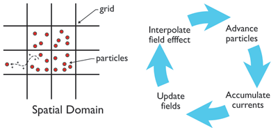
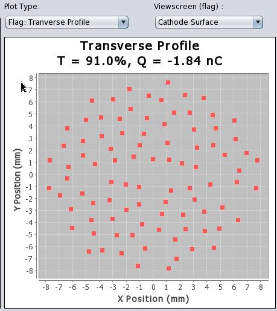
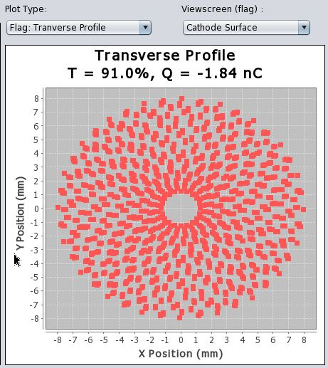

# Introduction: How Electron Beams Are Simulated

The GUI is a front end for two simulation codes — [GPT](http://www.pulsar.nl/gpt/) and [BMAD](http://www.lepp.cornell.edu/~dcs/bmad/) — plus a simpler 1D cathode code written directly into the GUI. Different parts of the CESR Linac call for different approximations, hence three different codes working together.

## Particle Tracking

Tracking a bunch of electrons in an external field is conceptually simple: integrate the Lorentz force equation

**F** = q(**E** + **v** × **B**)

using your favorite numerical integrator (Euler, leapfrog, Runge-Kutta). For a handful of particles this is trivial. For 10 billion electrons it is not — hence **macroparticles**.

## Macroparticles

A macroparticle is a blob representing many individual electrons that all move as a unit. Accuracy depends on how many macroparticles are used; typically 100–10,000 is sufficient. This reduces the particle count by ~10⁶, and due to the N² scaling of Coulomb interactions, the computational savings are even larger.

## Space Charge

[Space charge](http://en.wikipedia.org/wiki/Space_charge) — Coulomb self-repulsion — is the primary computational challenge. Calculating it naively requires summing over all N(N−1) particle pairs: O(N²) operations. Doubling the particle count quadruples the time.

### Trick 1: No Space Charge at High Energy

Relativistic time dilation weakens space charge by a factor of γ. Once the beam energy is large enough, GPT is dropped in favor of BMAD, which is orders of magnitude faster and primarily ignores space charge.

### Trick 2: Particle-In-Cell (PIC)

GPT uses a [particle-in-cell](http://en.wikipedia.org/wiki/Particle-in-cell) method:

1. Define a coarse grid around the bunch.
2. Compute the charge density in each cell.
3. Solve Poisson's equation on the grid for the electric potential.
4. Interpolate fields back to particle positions.

This scales as O(N · M log M) rather than O(N²), where M is the grid size. GPT's implementation achieves approximately N^1.1 scaling.

### PIC Limitation: Large Energy Spread

GPT calculates space charge by boosting to the bunch rest frame, computing electrostatic forces, then transforming back. This only works if all particles have nearly the same energy. In the CESR linac, the bunch is a few nanoseconds long at emission: the front has already been accelerated to 64% of c by the 150 kV gun while the back is still at rest. There is no rest frame where all particles are approximately stationary, so GPT warns of a potential ~10% error in inter-particle forces.

## Cylindrical Symmetry (Default for CESR)

GPT offers an alternative: use **rings of charge** as macroparticles, assuming cylindrical symmetry. Only ~100 rings are needed for good accuracy, and the slow direct summation method remains tractable.

The CESR linac is cylindrically symmetric to a good approximation through the gun, solenoids, prebunchers, and linac section 1. Quadrupole magnets (fundamentally non-symmetric) appear only after section 1, where space charge is already negligible and BMAD takes over.

**Default setup:** GPT with cylindrical symmetry through section 1, then BMAD for the rest.

With and without enforcing cylindrical symmetry in post-processing:

  

## 1D Symmetry at the Cathode

Right at the cathode (~hundreds of µm), the cathode diameter (16 mm) greatly exceeds the cathode-grid separation, making the problem effectively **1D**. Charges are modeled as infinitely wide sheets:

- An infinite charged sheet produces a field **independent of position**.
- The total force on a sheet is just a count of sheets to the left vs. right — O(N log N) after sorting.

10,000 macroparticles can be simulated in a few seconds this way. The CESR gun uses [thermionic emission](http://en.wikipedia.org/wiki/Thermionic_emission): a filament heats until electrons boil off. A control grid a few hundred µm from the cathode is pulsed positive for a few nanoseconds to release a bunch. The emitted current is governed by the [Child-Langmuir Law](http://en.wikipedia.org/wiki/Space_charge#Child.27s_Law) (I ∝ V^3/2 in the DC limit); the simulation integrates the time-dependent case numerically.

## Summary: Three Regions

| Region | Code | Method | Key Approximation |
|--------|------|---------|-------------------|
| Cathode → grid | Custom Java (1D) | Charged sheets, O(N log N) | 2R ≫ L (cylindrical → planar) |
| Gun → end of section 1 | GPT | 2D cylindrically symmetric PIC | Cylindrical symmetry; energy spread warning |
| Section 1 → end of linac | BMAD | Full 3D tracking | Space charge neglected (high γ) |
