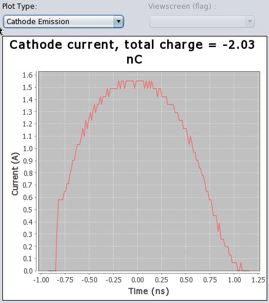
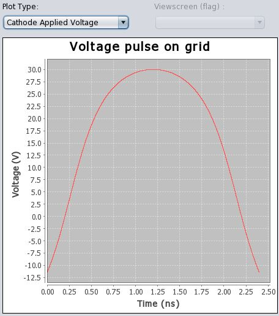
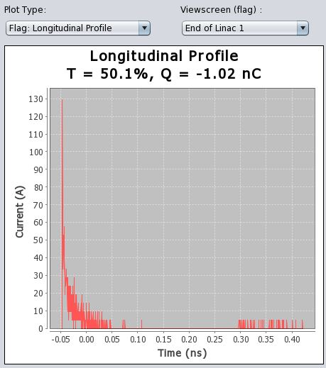
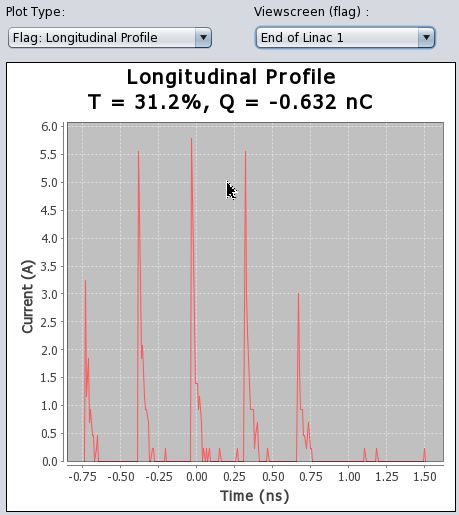
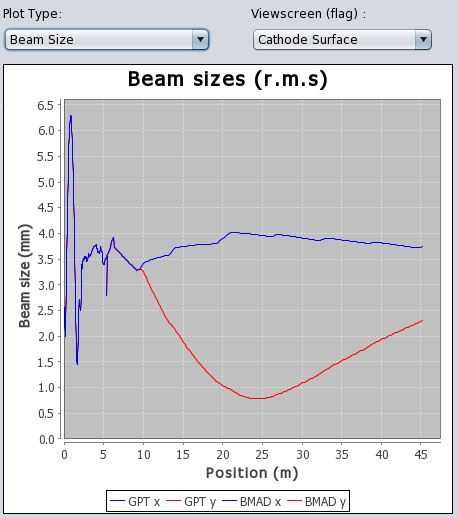
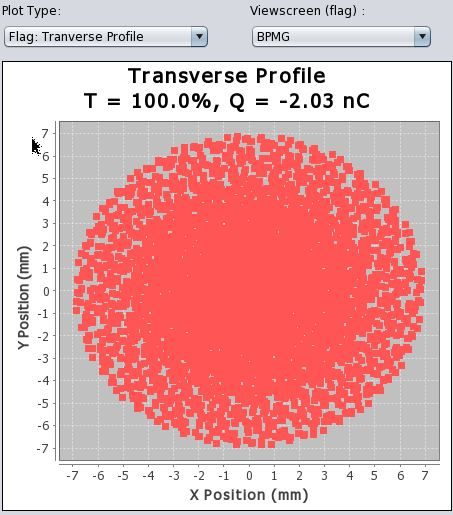
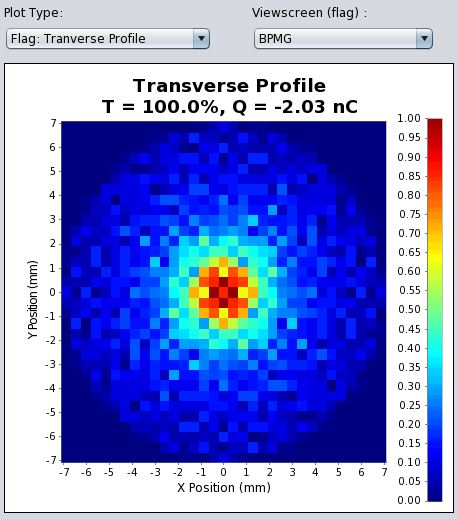
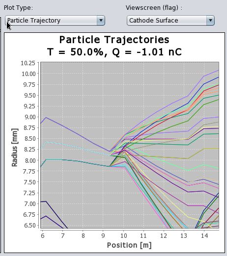

# User Guide: Linac Simulation GUI

## Running the Program

Start on a Linux terminal:
```
linac_sim
```

The program creates `~/.linac_sim_data/` with subdirectories: `input/`, `output/`, `initial_conditions/`, `saves/`. These can be replaced with symbolic links to avoid quota issues.


**Layout:** Left side = parameters to change. Right side = simulation run buttons and output plot window.

---

## Simulation Run Buttons

### Run Cathode

Runs the 1D cathode emission code. Takes a few seconds. Outputs:
- **Cathode Emission Current** (default plot) — current vs. time during the pulse
- **Cathode Applied Voltage** — the voltage pulse shape fed to the simulation

 

---

### Set Ref E

*You must run either this or Phase GPT — not both.*

Simulates a single reference particle in GPT with current settings. Sets the BMAD reference particle (BMAD requires all positions/energies relative to a reference). No new plots are generated. Takes seconds.

> **Warning:** Does not guarantee cavities are at the correct phase. Use only when you already know what you're doing.

---

### Phase GPT

*You must run either this or Set Ref E — not both.*

Automatically finds the **on-crest phase** for each RF cavity. GPT starts cavities at phase=0 at t=0 and the bunch arrives at an unknown phase depending on transit time. Phasing corrects for this.

**Algorithm:**
1. Turn off all RF cavities
2. Turn on the next cavity to be phased
3. Set its relative phase to 0 (start searching for on-crest)
4. Simulate a single particle while scanning the on-crest phase; find the phase that maximizes final energy
5. Reset the relative phase to user-specified value
6. Repeat for the next cavity

After completion, all cavities have correct on-crest phases and the BMAD reference particle is set (no need to press "Set Ref E" again).

**When do you need to re-phase?**
- If you change the **relative phase** of any cavity except the last one
- If you change the **input power** of any cavity except the last one
- If the **on-crest phases** were accidentally changed

*(You can change section 1's relative phase without re-phasing — just press "Set Ref E".)*

---

### Run GPT

Runs GPT with all configured settings. Time ranges from seconds to hours depending on particle count and space charge mode. All plots become available after completion; particle trajectories end after section 1.

**Example outputs:**

*1000 particles, no space charge — longitudinal profile after section 1:*

 

Left: bunchers on — large current spike ~10 ps wide, long tail, some leakage into the next RF bucket.  
Right: bunchers off — slices of cathode current profile, only particles that arrive near linac on-crest pass.

---

### Run BMAD

Continues the simulation where GPT ended. BMAD is nearly instantaneous to compute, but data import/export (ASCII format via Tao) can be slow. All data is appended to the GPT results.

**Caveats:**
- Brief wiggle in plots at the GPT/BMAD boundary (GPT output artifact with late-finishing particles affecting averages) — visible at z ≈ 5.4 m
- Beam pipe boundary is not plotted in the BMAD region (still simulated, just not shown)
- Emittance definition differs between GPT (experimentally measured) and BMAD (true invariant) — discontinuity in emittance plot is expected

**Take BMAD out of verbose mode** — it generates a large amount of output.

*Single quad turned on in section 2 (BMAD):*



---

## Parameter Tables (Left Panel)

### Machine Settings

Parameters are grouped by section, roughly in order a bunch encounters them:

| Section | Contents |
|---------|----------|
| **Gun** | Electron gun and cathode parameters |
| **Prebunchers** | Prebuncher RF controls; solenoid lenses 0A–0E, Sol 0 |
| **Section 1** | Accelerating cavity and Sol 1 (GPT); quads after cavity (BMAD) |
| **Section 2–4, 5–8** | Higher-energy linac sections and quads (BMAD) |

Each element has parameters listed with:
- **Sim Value / Sim Units** — value directly used by the simulation
- **Comp. Units** — CESR control system units *(currently disabled: not yet calibrated)*
- **Position** — beginning z-position of the element in the beamline

**Buttons:**
- *Enable section* — include/exclude this section from simulation
- *Turn all sections on* — enable all at once
- *Load selected parameters* — load highlighted values from CESR control system *(placeholder)*
- *Load ALL parameters* — load all values from CESR control system *(placeholder)*

---

## Plot Settings

### Histograms

Raw simulation data is individual particle positions/velocities. For dense beams, scatter plots become uninformative. Histograms bin particles on a coarse grid; the key setting is:

**Target max counts per bin:** The histogram starts with few bins and increases until the maximum bin count drops below this target. Set this once and most plots will be reasonable.

*Scatter plot vs. 2D histogram:*

 

### Cylindrical Symmetry Enforcement

The GPT portion uses cylindrical symmetry. "Enforcing" symmetry in post-processing duplicates each simulated particle into N copies, rotated by equal angles around the beam axis, each with 1/N of the original charge (conserving total charge). This improves the visual density of plots.

Toggle with "Enforce symmetry" while viewing a transverse profile scatter plot to see particles duplicated into rings.

> **Note:** If symmetry enforcement is on when BMAD runs, the duplicated particles are included in the BMAD simulation too (e.g., one particle trajectory becomes many at a quadrupole).

*With and without cylindrical symmetry:*

 

*One trajectory becoming many at a quad:*



### Parameter Reference

| Parameter | Description |
|-----------|-------------|
| *1D Histogram binning target* | Max counts per bin for 1D plots (e.g., longitudinal profile) |
| *Make 2D Histogram* | Use histograms for all 2D plots |
| *2D Histogram binning target* | Max counts per bin for 2D plots |
| *Max 2D Scatter* | Use scatter plots for all 2D plots |
| *Enforce cylindrical symmetry* | Duplicate GPT particles into rings (see above) |
| *Number of angular duplicates* | How many ring copies per particle |

---

## Cathode Settings

| Parameter | Value | Notes |
|-----------|-------|-------|
| Number of particles | 5000 | Runs in seconds, good accuracy; rarely needs changing |

---

## GPT Settings

| Parameter | Description |
|-----------|-------------|
| *Number of particles* | Macroparticles; see recommendations below |
| *Space charge* | Toggle space charge calculation |
| *Space Charge Type* | Cylindrically symmetric (default) or Fully 3D |
| *Data output timestep* | How often to record data (affects export time, not simulation time) |
| *Kill particles moving backwards* | Recommended on; backward particles slow GPT significantly |
| *Verbose output* | Show GPT console output |
| *Delete input files on exit* | Clean up generated input files |
| *Delete output files on exit* | Clean up output files (can be GB for large sims) |

**Recommended particle counts:**

| Mode | Quick | Good convergence | High quality |
|------|-------|-----------------|--------------|
| No space charge | 100 | 1000 | — |
| 2D cylindrical SC | 50 | 100–200 | 200+ (slow) |
| Fully 3D SC | 200 | 1000–10000 | — |

> **3D space charge caution:** Inaccurate for large energy spreads (cannot handle magnetic self-forces). Needs ~10× more particles than 2D for equivalent convergence.

---

## BMAD Settings

Same verbose and file-deletion options as GPT. Two output density controls:

- **Average beam parameter outputs** — quick, so many can be output along the lattice
- **Trajectory outputs** — large data volume, fewer output points recommended

Both are distributed uniformly over the simulation range.
